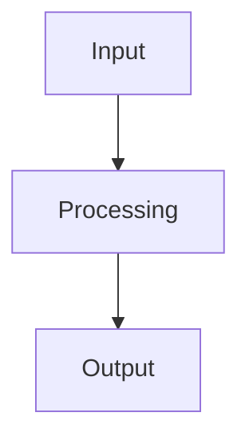
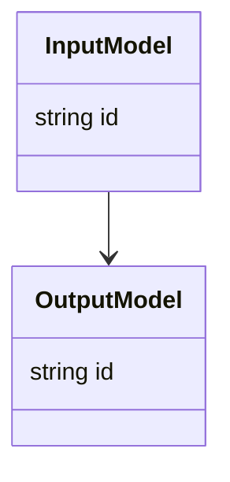

# Architecture

Use this skill to create or update an architecture document before implementation.

The output is a practical design artifact for the next agent or developer. It should make the intended behavior, boundaries, contracts, and trade-offs explicit without turning into implementation code.

## Default Location

If the user does not specify where to create or update the architecture, create:

```text
.cursor/plans/<index>-<name-slug>/architecture.md
```

Create `.cursor/plans/<index>-<name-slug>/` when it does not exist. `<name-slug>` — kebab-case from the task. `<index>` — `01`, `02`, …: next number in `.cursor/plans/` for a new task; reuse the existing folder when continuing.

If the user provides a specific target path, use that path instead.

## Inputs

Use only the task context needed for the architecture:

- the user's request;
- existing files inside `.cursor/plans/<index>-<name-slug>/`, if present;
- specific files, folders, or artifacts explicitly named by the user;
- files referenced by the plan artifacts when they are necessary to understand contracts or boundaries.

Do not perform broad repository exploration by default. If key information is missing, state the gap and either ask one focused question or make an explicit assumption.

## Procedure

1. Identify the target area, task type, and intended behavior.
2. Read the relevant plan folder (if used) and any user-specified files.
3. Define inputs, outputs, data flow, and artifact flow.
4. Define module boundaries and ownership of responsibilities.
5. Define data contracts, schemas, or models when they matter.
6. Add Mermaid diagrams when they clarify data flow, model relationships, module boundaries, or ER-style relationships.
7. Capture important assumptions, constraints, non-goals, and open questions.
8. Note meaningful alternatives only when there is a real design choice.
9. Write or update the architecture markdown.
10. Stop after the architecture is drafted. Do not implement code.

## Architecture Template

Use this compact structure. Remove sections that are not useful for the task.

~~~md
# Architecture - <task or component name>

## Context

<!-- What is being designed and why? What problem does it solve? -->

## Goal

<!-- What this architecture should enable. -->

## Inputs and Outputs

### Inputs

- ...

### Outputs

- ...

## Data Flow

<!-- Short explanation of the runtime or artifact flow. Add Mermaid only when it clarifies the design. -->



## Modules and Responsibilities

| Module / file | Responsibility | Notes |
|---|---|---|
| `...` | ... | ... |

## Data Contracts

<!-- Pydantic models, schemas, message shapes, key fields, relationships, and ownership. -->

| Contract / model | Purpose | Owner |
|---|---|---|
| `...` | ... | ... |

## Diagrams

<!-- Use Mermaid diagrams when they make the architecture easier to understand. Prefer flowchart for data/artifact flow, classDiagram for Pydantic/data models, erDiagram for entity relationships, and sequenceDiagram for cross-module interactions. -->



## Artifacts

<!-- Files, directories, snapshots, debug outputs, reports, or runtime artifacts. -->

| Artifact | Producer | Consumer | Notes |
|---|---|---|---|
| `...` | ... | ... | ... |

## Assumptions and Decisions

- ...

## Alternatives Considered

- ...

## Constraints and Non-goals

- ...

## Validation Expectations

- ...

## Open Questions

- ...
~~~

## Quality Rules

The architecture should be:

- concise enough to use in a new chat;
- specific enough to prevent silent contract or responsibility drift;
- explicit about inputs, outputs, artifacts, and ownership;
- clear about assumptions and decision drivers;
- proportionate to the expected research/pilot scope;
- aligned with core architecture principles such as separation of concerns, clear contracts, low coupling, and high cohesion;
- honest about trade-offs and consequences when alternatives exist;
- conservative about new abstractions.

Avoid:

- implementation code or detailed pseudocode;
- broad repository summaries;
- process-heavy ADR lifecycle language;
- new modules, classes, or services without a clear responsibility;
- mixing IO, orchestration, external calls, metrics, and validation in one unit;
- adding generic architecture sections that do not help the task.
