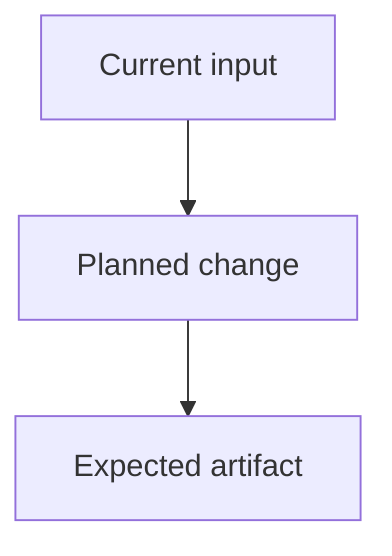

# Implementation Plan

## Purpose

Create a structured implementation plan before coding.

The plan should capture enough technical reasoning, ordered work blocks, and validation detail for a future coding chat to execute the work without redoing the planning pass.

## Inputs

Use the context attached by the user and inspect only the repository areas needed to make the plan concrete. Do not require any specific artifact name or prior planning format.

If important requirements are missing, ask concise clarifying questions. If the plan can still be useful, proceed and mark assumptions explicitly.

## Output

Create a markdown plan. If the user provides a path, write there. Otherwise prefer:

```text
.cursor/plans/<index>-<name-slug>/implementation.plan.md
```

`<name-slug>` — kebab-case from the task. `<index>` — `01`, `02`, …: next number in `.cursor/plans/` for a new task; reuse the existing folder when continuing.

Use the frontmatter shape below when the environment supports markdown metadata. In plain markdown environments, keep the same content and omit unsupported metadata only if necessary.

## Workflow

1. Restate the task in one short paragraph.
2. Read the supplied context and repository rules.
3. Inspect relevant code paths, tests, configs, and docs.
4. Identify the implementation strategy, main tradeoffs, and assumptions.
5. Decompose the work into ordered blocks with concrete tasks.
6. Add validation that proves the implemented plan worked.
7. Write the plan and stop. Planning does not include code changes.

## Plan Structure

Adapt the structure to the task. Keep it useful, not ceremonial.

````md
---
name: <short task name>
overview: <one sentence summary>
todos:
  - id: block-1-<slug>
    content: <Block 1 summary>
    status: pending
  - id: block-2-<slug>
    content: <Block 2 summary>
    status: pending
isProject: false
---

# Implementation Plan - <task title>

## Source Context

<!-- Link only to context actually used. Do not duplicate long source material. -->

- <source or path>
- <source or path>

## Overview

<!-- Explain the goal, current system shape, chosen direction, and important assumptions. -->

## Workflow

<!-- Optional. Use a small Mermaid diagram when data flow, control flow, or artifact flow matters. -->



## Build

<!-- Mirror the frontmatter todos. Keep this filled, not placeholder-only. -->

- [ ] Block 1 - <short block name>
- [ ] Block 2 - <short block name>

## Blocks

### Block 1 - <name>

<!-- Self-contained enough to paste into a new chat. Mention important files, constraints, validation, and non-goals inline instead of forcing separate fields for every block. -->

Goal: <what this block accomplishes and why it comes first>

Implementation notes:

- Inspect `...`
- Change `...`
- Keep `...` stable

Tasks:

- [ ] ...
- [ ] Validate with `...`

Done when:

- <observable result or passing check>

### Block 2 - <name>

Goal: ...

Implementation notes:

- ...

Tasks:

- [ ] ...

Done when:

- ...

## Final Validation

<!-- End-to-end checks after all blocks are complete. -->

## Assumptions / Follow-ups

<!-- Include only assumptions or follow-ups that materially affect implementation. -->

## Plan Update Rules

After implementing block(s):

- mark completed tasks;
- add short notes about actual files changed;
- update assumptions if they changed;
- do not rewrite completed context unless it is wrong.
````

## Planning Rules

- Prefer repository patterns over new abstractions.
- Keep the plan executable: name likely files, commands, artifacts, and validation checks.
- Make tradeoffs explicit when there are multiple reasonable approaches.
- Do not bury unresolved product or architecture decisions inside implementation tasks; mark them as assumptions or questions.
- Keep optional sections only when they make the plan easier to execute.

## Language

Write the plan in the same language as the user's request unless they ask otherwise.