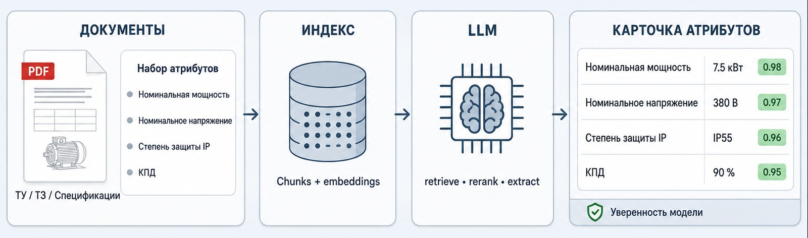

# Извлечение атрибутов из техдокументации

LLM-пайплайн: по списку позиций и PDF техдокументов извлекает значения атрибутов изделия (мощность, напряжение, степень защиты и т.п.) и отдаёт карточку с оценкой уверенности для проверки экспертом.



## Результаты пилота


| Метрика               | Значение  | Цель  |
| --------------------- | --------- | ----- |
| Automation Rate       | **74,3%** | ≥ 55% |
| NPV @ high confidence | **90,0%** | ≥ 90% |
| Net Effect            | **0,37**  | ≥ 0,2 |


Сюжет экспериментов, разбивка по классам изделий и журналы решений — в `[research/steps/README.md](research/steps/README.md)`.

## Быстрый просмотр

Статический UI на synthetic-данных — без Docker, LLM и ключей:

```bash
cd apps/demo-app && python3 -m http.server 4173
```

Открыть [http://localhost:4173](http://localhost:4173).

Seed: `[research/datasets/demo](research/datasets/demo)` (класс `demo-motor`, 4 позиции, в т.ч. multi-PDF и скан).

## Подход

Документ-центричный пайплайн с поэтапной оценкой гипотез:

```text
ocr → markdown → chunking → vectorizing → retrieval
  → merge → attribute_grouping → reranking
  → context_grouping → context_rebuild → extraction
```

Ключевые решения зафиксированы в журналах `history/H00x` (retrieval → rerank → extraction). Полный список шагов и метрики — в `[research/steps/README.md](research/steps/README.md)`.

## Навигация


| Что смотреть                            | Куда                                                   |
| --------------------------------------- | ------------------------------------------------------ |
| Сюжет экспериментов и метрики           | `[research/steps/README.md](research/steps/README.md)` |
| Журналы retrieval / rerank / extraction | `research/steps/*/eval/experiments/history/`           |
| EDA (состав данных, атрибуты, единицы)  | `[research/lab/](research/lab/)`                       |
| Synthetic demo-пакет                    | `[research/datasets/demo](research/datasets/demo)`     |
| UI-mock (без бэкенда)                   | `[apps/demo-app](apps/demo-app)`                       |
| Рабочее MVP (API + UI + пайплайн)       | `[apps/attribute_extractor](apps/attribute_extractor)` |


## Структура репозитория

```text
research/
  steps/          # код и eval шагов пайплайна
  datasets/demo/  # synthetic вход для demo
  lab/            # EDA-ноутбуки
apps/
  demo-app/              # статический storyboard
  attribute_extractor/   # FastAPI + React + Compose
infra/                   # config, LLM-клиенты, eval runner
```


## Рабочее MVP (опционально)

Полный цикл upload → validate → process → export:

```bash
cd apps/attribute_extractor && docker compose up --build
```

- UI: [http://localhost:5173](http://localhost:5173)
- API / Swagger: [http://localhost:8000/docs](http://localhost:8000/docs)

По умолчанию образ поднимает API/UI. Для живого `/process` (OCR → … → extraction) нужна пересборка с `INSTALL_PIPELINE=1` и ключи LLM в `.env` (см. `[.env.example](.env.example)` и `[apps/attribute_extractor/README.md](apps/attribute_extractor/README.md)`).

Research-шаги локально: `pip install -r requirements.txt`, `.env.example` → `.env`, параметры в `config.yaml`; детали — в README конкретного шага.

## Данные

В git только **synthetic / обезличенные** артефакты. Реальные PDF и реестры заказчика в репозитории отсутствуют.

## Ограничения

- UI-mock показывает сценарий пилота на synthetic; это не live-инференс.
- Compose без `INSTALL_PIPELINE` и LLM-ключей не прогоняет полный пайплайн.
- Сканы / VLM — расширение за рамками пилота; в demo есть позиция-скан как входной кейс.

