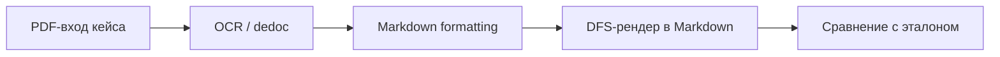

# E001 - Baseline: dedoc OCR → Markdown (document parsing)

## 1. Approach

Baseline фиксирует текущую цепочку **document-to-Markdown** — ту же, что используется в upstream-пайплайне извлечения атрибутов до chunking. Задача бенчмарка — по странице (или небольшому диапазону страниц) PDF получить Markdown, сопоставимый с эталонной разметкой, и измерить качество транскрипции, таблиц и структуры документа.

### Оцениваемый объём данных

| Параметр | Значение |
| -------- | -------- |
| Датасет | `ocr_benchmark` (manifest v1) |
| Число кейсов | 24 |
| Единица оценки | одна страница или короткий диапазон страниц |
| Источники | NSI и UKIDIM |
| Эталон | курируемый Markdown reference на кейс |

Кейсы покрывают разнообразие входов, релевантное для downstream extraction: born-digital ТУ/ТЗ, синтетические сканы, плотные и широкие таблицы, bilingual-блоки, паспорт, ГОСТ, каталог, web-screenshot, рукопись на титуле, битый text layer, поворот страницы, смешанный text+scan. Часть кейсов отобрана по **ролям контента**, полезным для извлечения (титул, назначение, теххарактеристики, комплектность, материалы, bilingual kv-таблицы, приложения с вариантами исполнения).

Ground truth — не сырой text layer PDF, а **целевой Markdown** после визуальной сверки: штампы, рукописные подписи и прочий шум, не несущий смысла для задачи, в эталон не включаются.

### Архитектура пайплайна

**OCR и структурная разметка (dedoc)**

Стандартный dedoc переопределён под документы формата ТЗ/ТУ:

- дополнительные паттерны классификации строк (`tz_part`, `tz_subpart`, заголовки, части правил);
- постпроцессинг дерева структуры (сплит rule-строк, выравнивание уровней заголовков, унификация типов на одном уровне);
- корректная привязка таблиц к подписям (caption выше таблицы в дереве, а не до неё).

Ключевые параметры dedoc для бенчмарка: разбор PDF с text layer через Tabby, дерево структуры, анализ таблиц, ГОСТ-рамок, колонтитулов и вложений.

**Markdown formatting**

Детерминированное преобразование `ParsedDocument` в промежуточное дерево:

- структурный текст обходится независимо от таблиц;
- таблицы выносятся в sidecar с uid и подставляются плейсхолдерами в дерево;
- inline-аннотации (bold, italic, ссылки) нормализуются в markdown-текст узлов.

**Финальный рендер**

Плоский Markdown получается DFS-обходом дерева с подстановкой таблиц и удалением attachment-плейсхолдеров. Промежуточные артефакты OCR и formatting сохраняются для диагностики, но **скоринг не зависит от формата dedoc** — сравниваются только предсказанный и эталонный Markdown.

### Контракт оценки

Сравнение идёт по **каноническому Markdown** после backend-neutral нормализации: Unicode NFKC, унификация `ё`/`е`, снятие inline-форматирования, детерминированные pipe-таблицы, раскрытие merged cells. Метрики измеряют содержимое и структуру после удаления оформительского шума, а не сырой вывод модели.

Агрегация — **macro mean по кейсам**; сводного headline-score нет. Метрики выбираются под гипотезу эксперимента:

| Слой | Метрики | Что отвечают |
| ---- | ------- | ------------ |
| Текст | `cer`, `wer`, `token_f1` | OCR-опечатки, пропуски/галлюцинации слов, лексическое покрытие |
| Таблицы | `teds`, `teds_s` | Текст и структура таблиц; отделение layout-ошибок от OCR в ячейках |
| Структура | `structural_counts_similarity`, `heading_sequence_f1`, `ast_structure_similarity` | Счётчики блоков, outline заголовков, дерево типов блоков |

Для интерпретации baseline важны per-case строки и срезы по лейблам манифеста (`doc_type`, `technical_tags`), а не только run-level средние: macro mean одинаково чувствителен к катастрофическому outlier и к множеству мелких регрессий.

Трассировка прогонов — MLflow experiment `nsi-attribute-extraction-ocr`.

## 2. Expected effect / hypothesis

Baseline не проверяет конкретное улучшение — он **фиксирует отправную точку** для всех последующих экспериментов над OCR, разметкой структуры и Markdown-рендером.

**Гипотеза baseline:** текущая цепочка dedoc + markdown formatting на датасете `ocr_benchmark` даёт **измеримый и воспроизводимый** профиль качества, достаточный для:

1. **Сравнения** с будущими вариантами пайплайна (другие OCR-бэкенды, доработки dedoc, изменения formatting/рендера, постобработка таблиц).
2. **Связи с downstream extraction** — понять, на каких типах входов и ролей контента ошибки парсинга с наибольшей вероятностью деградируют retrieval и извлечение атрибутов.
3. **Диагностики** слабых мест через раздельные метрики: текстовые ошибки (`cer`/`wer`), потеря таблиц (`teds` vs `teds_s`), сбои структуры (`heading_sequence_f1`, `ast_structure_similarity`).

**Ожидаемый профиль ошибок (качественно, без чисел):**

- на **born-digital** кейсах — относительно высокие текстовые и структурные метрики; основные потери — в таблицах со сложным layout или merged cells;
- на **image-only scan** и **dense_table** — просадка `cer`/`wer` и `teds`; `teds_s` может оставаться выше `teds`, если структура угадана, а текст в ячейках испорчен;
- на **broken text layer** / **OCR overlay** — деградация кириллицы и token-level метрик при сохранении части структурного скелета;
- на **handwritten** и **sparse** входах — локальные провалы транскрипции при приемлемом outline;
- на **bilingual** и **wide appendix** кейсах — ошибки в kv-таблицах и широких матрицах исполнений, критичных для extraction;
- расхождение **heading F1** и **AST similarity** — сигнал, что заголовки в целом на месте, но списки, абзацы или размещение таблиц «поплыли».

Baseline считается установленным после первого полного прогона на всех 24 кейсах с логированием в MLflow и сохранением snapshot артефактов для последующего error analysis.

## 3. Runs and metrics

| Подход / вариант | MLflow run_id | Ключевое отличие | Релевантные метрики | Примечания |
| ---------------- | ------------- | ---------------- | ------------------- | ---------- |
| Baseline (полный manifest, 24 кейса) | `228e6364a091441b9c2a1d926d15ff09` | dedoc + markdown formatting, `eval_mode=rebuild` | см. ниже | experiment `2` (`nsi-attribute-extraction-ocr`), run name `baseline`, status `FINISHED`, commit `bcb85f41`, `case_count=24`, `dataset_digest=8be794cc…`, `OCR.on_gpu=True`, артефакты: `snapshot/` |

**Метрики baseline (macro mean, шкала 0–1, выше = лучше)**

| Метрика | Значение |
| ------- | -------- |
| `cer` | 0.416 |
| `wer` | 0.375 |
| `token_f1` | 0.508 |
| `teds` | 0.572 |
| `teds_s` | 0.615 |
| `structural_counts_similarity` | 0.865 |
| `heading_sequence_f1` | 0.499 |
| `ast_structure_similarity` | 0.438 |
| `case_count` | 24 |

**Производные наблюдения из залогированных метрик**

| Наблюдение | Формула / источник | Значение |
| ---------- | ------------------ | -------- |
| Разрыв структуры таблицы vs текст ячеек | `teds_s − teds` | 0.043 |
| Разрыв outline vs AST | `heading_sequence_f1 − ast_structure_similarity` | 0.061 |
| Разрыв счётчиков блоков vs AST | `structural_counts_similarity − ast_structure_similarity` | 0.427 |

Ранние прогоны на подмножестве (`case_count=5`, другой `dataset_digest`) в тот же experiment не относятся к baseline полного датасета и в сравнение не включены.

Срезовые метрики по `doc_type`, `technical_tags` и per-case распределения в MLflow **не залогированы**; доступны только в артефакте `snapshot/cases.jsonl`.

## 4. Interpretation

**Наблюдаемые значения.** Полный rebuild-baseline на 24 кейсах завершился успешно и дал воспроизводимый набор scalar metrics. Наиболее высокий слой — `structural_counts_similarity` (0.865): агрегатно счётчики заголовков, table-block и data-row близки к эталону. Текстовый слой заметно слабее: `cer` 0.416, `wer` 0.375, `token_f1` 0.508 — примерно половина лексического покрытия bag-of-words и существенная доля символьных/словесных правок. Таблицы — середина шкалы (`teds` 0.572, `teds_s` 0.615). Структурные метрики outline и AST — умеренные (`heading_sequence_f1` 0.499, `ast_structure_similarity` 0.438).

**Сравнение с гипотезой baseline.**

- **Измеримость и воспроизводимость:** подтверждается — run `FINISHED`, `case_count=24`, полный набор метрик контракта залогирован, snapshot артефактов доступен.
- **Качественный профиль по срезам** (born-digital vs scan, broken layer, bilingual и т.д.): **проверить нельзя** — slice-метрики не залогированы; агрегаты не позволяют подтвердить или опровергнуть ожидаемые провалы по типам входов.
- **Разрыв `teds_s` ≫ `teds`:** не наблюдается — разрыв всего 0.043. На уровне macro mean нельзя сказать, что layout таблиц в основном верен при систематически испорченном тексте ячеек; скорее оба компонента деградируют умеренно и близко друг к другу.
- **Разрыв heading F1 vs AST similarity:** частично согласуется с гипотезой — `heading_sequence_f1` (0.499) выше `ast_structure_similarity` (0.438) на 0.061. Это может указывать, что подписи заголовков и их порядок сохраняются лучше, чем общая смесь и вложенность типов блоков; механизм (списки vs абзацы, размещение таблиц) из агрегатов не доказан.
- **`structural_counts_similarity` ≫ `ast_structure_similarity`:** разрыв 0.427 — крупный. Агрегатно число блоков по типам близко к эталону, тогда как дерево блоков существенно расходится. Это согласуется с тем, что пайплайн часто «попадает» в количественный скелет документа, но теряет точную структурную форму.

**Trade-offs и неожиданности.**

- `token_f1` (0.508) не сильно выше `cer`/`wer` — нет паттерна «нужные слова есть, но перепутаны»: текстовые ошибки выглядят как смесь пропусков, замен и перестановок, а не только порядкового шума.
- `wer` (0.375) ниже `cer` (0.416) — на macro mean словесные правки чуть реже символьных; без per-case разбора причину (опечатки vs пропуски слов) утверждать нельзя.
- Все три структурные метрики не образуют единого «высокого» или «низкого» профиля: counts высокие, heading F1 средний, AST низкий. Для downstream chunking/navigation это может означать, что навигация по заголовкам частично жизнеспособна, а структурная сегментация по типам блоков — ненадёжна; нужна проверка по кейсам.

**Статус интерпретации.** По scalar metrics baseline **установлен как измеримая отправная точка**: полный прогон на 24 кейсах есть, профиль метрик зафиксирован. Основной вывод уровня метрик: сильная сторона — количественный структурный скелет (`structural_counts_similarity`), слабые — текстовая транскрипция и AST-форма документа; таблицы и outline — на среднем уровне. Не подтверждено: соответствие ожидаемому профилю по срезам входов, локализация outlier-кейсов, причины разрыва counts vs AST. Для уточнения нужен error analysis по `cases.jsonl` и срезы по лейблам манифеста — до этого интерпретация ограничена уровнем macro mean.

## 5. Error analysis

Источник: `snapshot/cases.jsonl` и canonical pred/GT из артефактов run `228e6364a091441b9c2a1d926d15ff09`. Анализ — крупными мазками по доминирующим группам, без точечного разбора кейсов.

**Уточнение к §4.** Срезы по лейблам из `cases.jsonl` подтверждают гипотезу baseline по типам входов, которую scalar metrics скрывали: `image_only_scan` (6 кейсов) — полный провал (`cer`≈0, пустой pred); `born_digital_good` при непустом выводе — текст в основном хороший (mean `cer`≈0.70 по 13 кейсам с контентом). Macro mean `cer`=0.416 сильно занижен **8 пустыми предсказаниями** (33% датасета); на оставшихся 16 кейсах mean `cer`≈0.62.

### 1. Полный провал пайплайна на «тяжёлых» входах — главный рычаг

**Масштаб:** 8/24 кейсов дают пустой или почти пустой `pred.canonical.md` (`pred.raw.md` тоже пуст).

**Срез:** все 6 кейсов с тегом `image_only_scan`; плюс `broken_text_layer`, `rotated_page` (в т.ч. born-digital), `sparse_page`, `handwritten_marks`.

**Суть:** dedoc не извлекает содержимое → downstream formatting/рендер нечего превращать в Markdown. Это не «плохой OCR», а отсутствие выхода. На macro mean бьёт по всем слоям сразу: `cer`/`token_f1`→0, `teds`→0, `ast_structure_similarity`→0.

**Потенциал буста:** самый высокий. Восстановление хотя бы базового текста/таблиц на scan-входах даст скачок по всем метрикам, а не точечную подкрутку.

### 2. Потеря и склейка таблиц — второй по масштабу рычаг

**Масштаб:** 9/24 кейсов — `pred_tables < gt_tables`; средний `teds` по тегу `dense_table` — 0.29 (vs 0.57 macro).

**Два подрежима:**

- **Таблица не детектирована** — следствие группы 1 на scan/rotated; на born-digital реже, но есть (например, `catalog-belimo`: текст есть, pipe-таблицы нет).
- **Таблица детектирована, но сегментация неверна** — тег `table_across_pages`: несколько таблиц на диапазоне страниц сливаются в одну (`spec-kur0130`: 1 pred / 3 gt) или теряется продолжение (`extract-appendix-params`: 5/6, `extract-appendix-variants`: 1/2). Текст при этом часто читаем.

**Потенциал буста:** высокий для extraction-ролей «теххарактеристики», «комплектность», «материалы», bilingual kv — все завязаны на `dense_table`.

### 3. Структурная форма при приемлемом тексте — объясняет разрыв counts vs AST

**Масштаб:** у 12/24 кейсов `structural_counts_similarity − ast_structure_similarity` > 0.4; типично при непустом pred на born-digital.

**Повторяющиеся паттерны (не единичные кейсы):**

- **Штампы/колонтитулы ГОСТ** попадают в pred как обычный текст, в GT отфильтрованы → лишние «блоки», сбивают AST и иногда `heading_sequence_f1` (например, `extract-purpose`, `extract-completeness`: текст `cer`>0.94, но `hF1`=0 — заголовок «ВВОДНАЯ ЧАСТЬ» в pred без `#`, штамп в начале).
- **Заголовки разделов ТЗ** не распознаются как heading: GT `## ВВОДНАЯ ЧАСТЬ`, pred — plain text; подписи таблиц (`# Таблица 1.1`) → plain text без `#`.
- **Merged cells** в pipe-таблицах: вместо пустых ячеек — дублирование текста по всей строке (встречается в ~половине непустых born-digital с таблицами); бьёт по `teds` и `ast`.
- **Списки** рендерятся inline (`- пункт` в одной ячейке/абзаце вместо markdown-list) — типично для bilingual kv-таблиц и многострочных ячеек.

**Потенциал буста:** средний–высокий для `heading_sequence_f1` и `ast_structure_similarity`, умеренный для `teds`. Текстовые метрики при этом часто уже хорошие — правки в formatting/постпроцессинге, а не в OCR.

### 4. Качество ячеек в детектированных таблицах — локальный, не доминирующий слой

**Масштаб:** macro `teds_s − teds` = 0.043 — разрыв мал; layout и текст в ячейках деградируют вместе.

**Где заметнее:** bilingual/kv-таблицы (`extract-bilingual-kv`: `teds`=0.07 при двух pred-таблицах vs одной gt); wide appendix с merged/group rows. Паттерн — структура таблицы «похожа», но ячейки разъезжаются по colspan/содержимому.

**Потенциал буста:** умеренный на macro mean; важен для конкретных extraction-ролей (bilingual kv), но не объясняет провал baseline целиком.

### 5. Что НЕ является массовой проблемой

- **OCR-опечатки на born-digital** — при непустом выводе `cer` обычно 0.8–0.99; основной текст ТЗ/ТУ читается.
- **Потеря outline при сохранении слов** — редкий паттерн; `token_f1` не сильно выше `cer`/`wer` именно потому, что главные потери — пустой вывод и таблицы, а не перестановка слов.
- **«Layout таблиц верен, текст в ячейках испорчен»** — на macro не доминирует (`teds_s − teds` мал).

### Приоритеты для следующих экспериментов (по ожидаемому бусту macro mean)

| Приоритет | Группа ошибок | Затронутые метрики | Ориентир среза |
| --------- | ------------- | ------------------ | -------------- |
| 1 | Пустой вывод на scan/rotated/broken layer | все | `image_only_scan`, `rotated_page`, `broken_text_layer` |
| 2 | Детекция и сегментация таблиц (вкл. across pages) | `teds`, `teds_s`, AST | `dense_table`, `table_across_pages` |
| 3 | Постпроцессинг структуры: штампы, heading-типизация, merged cells, списки | `heading_sequence_f1`, `ast_structure_similarity` | born-digital extraction-роли |
| 4 | Нормализация bilingual/kv-таблиц | `teds` на отдельных кейсах | `bilingual`, `dense_table` |

Для мониторинга прогресса имеет смысл логировать slice-метрики по `technical_tags` в MLflow — без этого macro mean смешивает «пайплайн молчит» и «пайплайн работает, но криво структурирует».

## 6. Conclusion

Baseline **установлен**: полный прогон на 24 кейсах воспроизводим, метрики и snapshot зафиксированы — цель §2 (измеримая отправная точка) достигнута.

По сути профиля: пайплайн **хорошо работает на born-digital** (текст `cer`≈0.7–0.99 при непустом выводе), но **систематически молчит на scan-like входах** — 8/24 кейсов (все `image_only_scan` и соседние теги) дают пустой pred. Именно это главный объяснитель низкого macro mean (`cer`=0.416); на кейсах с контентом картина заметно лучше (`cer`≈0.62). Второй слой потерь — таблицы (`dense_table` mean `teds`≈0.29) и структурная форма (разрыв counts vs AST), но они вторичны относительно полного отсутствия вывода на сканах.

Качественная гипотеза baseline по срезам входов **подтвердилась** в §5, хотя scalar metrics её изначально скрывали. Не закрыто: влияние `auto_tabby`/Tesseract на scan-кейсы — предстоит проверить отдельным экспериментом.

## 7. Decision

E001 принимаем как **рабочий baseline** для born-digital ветки; следующий эксперимент — переключение PDF-парсера с `tabby` на `auto_tabby` (Tesseract под капотом dedoc) с фокусом на slice `image_only_scan` и смежные теги (`rotated_page`, `dense_table` на scan). Структурный постпроцессинг и `table_across_pages` на born-digital откладываем до появления хотя бы базового вывода на сканах.
