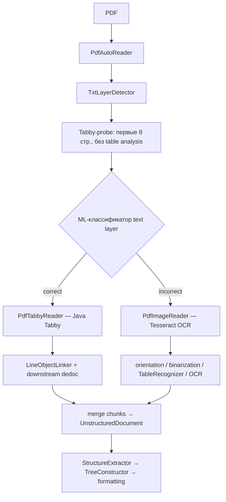

# E002 - dedoc OCR → Markdown: `auto_tabby` vs baseline `tabby`

## 1. Approach

Единственное изменение относительно [E001](E001-dedoc-baseline.md) — режим разбора PDF с text layer в dedoc: **`tabby` → `auto_tabby`**.

Остальная цепочка без изменений: кастомный dedoc (постпроцессинг структуры ТЗ/ТУ, tree constructor), детерминированный markdown formatting и тот же контракт оценки по каноническому Markdown на `ocr_benchmark` (24 кейса, macro mean по метрикам `cer`/`wer`/`token_f1`, `teds`/`teds_s`, структурные метрики).

**Сравниваем с:** E001 baseline (`dedoc.pdf_with_text_layer=tabby`, run `228e6364a091441b9c2a1d926d15ff09`).

**Фокус интерпретации:** срезы `image_only_scan`, `rotated_page`, `broken_text_layer`, `sparse_page`, `handwritten_marks` — кейсы, где E001 давал пустой или почти пустой pred; вторично — не просели ли born-digital кейсы с хорошим text layer.

### Как работает `auto_tabby` в dedoc

`auto_tabby` — не «гибридный Tabby», а **маршрутизатор** `PdfAutoReader`: dedoc сначала решает, пригоден ли text layer, и только потом выбирает один из двух принципиально разных бэкендов извлечения.

#### 1. Выбор ридера

| `pdf_with_text_layer` | Активный ридер | Поведение |
| --------------------- | -------------- | --------- |
| `tabby` (E001) | `PdfTabbyReader` напрямую | Всегда Java Tabby по text layer; scan без layer → пустой/мусорный вывод |
| `auto_tabby` (E002) | `PdfAutoReader` | Детекция layer → Tabby **или** image/OCR; при смешанном документе — по чанкам страниц |

`ReaderComposition` берёт **первый** ридер с `can_read() == True`. При `auto_tabby` срабатывает `PdfAutoReader` (он стоит в списке **раньше** `PdfTabbyReader`), поэтому прямой Tabby-ридер не используется.

#### 2. Детекция text layer (`TxtLayerDetector`)

По умолчанию (`each_page_textual_layer_detection=false`, режим `__classify_all_pages`):

1. **Probe:** `PdfTabbyReader` читает **первые 8 страниц** с `need_pdf_table_analysis=false` (быстрая проверка без полного table pipeline).
2. **Классификация:** ML-классификатор (`textual_layer_classifier=ml`, XGBoost на символьных фичах: доли кириллицы/латиницы, «мусорные» символы, смены регистра и т.п.) решает, **correct** ли text layer для всего документа.
3. **Спецслучай первой страницы:** если документ в целом correct, но **только page 1** — incorrect (типично: scan + born-digital хвост), dedoc делит документ на два чанка: стр. 1 → OCR, остальное → Tabby.
4. **Fallback:** при ошибке детекции — весь документ считается incorrect → OCR.

Альтернатива: `each_page_textual_layer_detection=true` — классификация **постранично**, документ режется на чередующиеся чанки correct/incorrect с merge в конце.

Пустой probe (`document.lines == []`) → incorrect → OCR. Это ключевой механизм для `image_only_scan`.

#### 3. Ветка Tabby (correct text layer)

`PdfTabbyReader` → Java `ispras_tbl_extr.jar`:

- извлекает **blocks** (текст + bbox + font metadata), **tables** (cells, colspan/rowspan), **images**;
- опционально: GOST-frame boxes (`need_gost_frame_analysis`), header/footer detection, multipage table merge;
- `LineObjectLinker` привязывает таблицы и attachments к строкам;
- paragraph extractor группирует строки.

Таблицы здесь — из **text layer / Tabby layout**, не из Tesseract.

#### 4. Ветка image/OCR (incorrect text layer)

`PdfImageReader` — отдельный CV+OCR pipeline **по растеризованным страницам**:

| Шаг | Компонент dedoc | Зачем |
| --- | --------------- | ----- |
| Рендер страницы | `PdfBaseReader._get_images` | PDF → image |
| Ориентация и колонки | `ColumnsOrientationClassifier` (EfficientNet) | auto-rotate 0/90/180/270, one/two column |
| Бинаризация | `AdaptiveBinarizer` (если `need_binarization=True`) | у нас выключено |
| Таблицы | `TableRecognizer.recognize_tables_from_image` | CV-детекция таблиц на image, **не** Java Tabby |
| Текст | `OCRLineExtractor` → **pytesseract** | `rus+eng`, PSM 4 (one column) / PSM 3 (two column) |
| Метаданные строк | `LineMetadataExtractor` | bold и прочие scan-аннотации |
| Абзацы | `ScanParagraphClassifierExtractor` | группировка OCR-строк |

Таблицы на OCR-ветке проходят через **другой** table pipeline, чем на Tabby-ветке — это важно при разборе расхождений `teds`/`teds_s`.

#### 5. Merge смешанных документов

Если детектор вернул несколько `TxtLayerResult`-чанков, `PdfAutoReader.__merge_documents` склеивает lines/tables/attachments, перенумеровывает `line_id`, фильтрует «осиротевшие» table/attach annotations. Warnings содержат лог вида `Assume document … has correct/incorrect textual layer on pages [start:end]` — полезный якорь при разборе per-case.

#### 6. Отличие от E001 на уровне dedoc

| Аспект | E001 `tabby` | E002 `auto_tabby` |
| ------ | ------------ | ----------------- |
| Триггер OCR | никогда | при incorrect/пустом layer |
| Scan без text layer | Tabby → пусто | PdfImageReader → Tesseract |
| Битый layer (мусорные символы) | Tabby читает as-is | ML-классификатор может отправить на OCR |
| Таблицы на scan | нет (нет контента) | TableRecognizer + OCR ячеек |
| Смешанный doc (scan titul + digital body) | один режим | split: OCR + Tabby по страницам |
| Probe cost | нет | +1 Tabby-pass на первые 8 стр. |

#### 7. Взаимодействие с нашим пайплайном (confounders)

Кастомный **TableAwareLineObjectLinker** в репозитории инжектится только в **верхнеуровневый** `PdfTabbyReader` из `ReaderComposition`. При `auto_tabby` активен `PdfAutoReader`, который держит **свой внутренний** стандартный `PdfTabbyReader` и `PdfImageReader` — **без** нашего linker patch.

Следствия для error analysis:

- на Tabby-ветке E002 caption-таблицы могут вести себя как **stock dedoc**, не как E001;
- на OCR-ветке используется stock `LineObjectLinker` + scan paragraph extractor — другая структурная семантика, чем у text-layer Tabby;
- постпроцессинг структуры ТЗ/ТУ (`PostProcessedStructureExtractor`, `CustomTreeConstructor`) одинаков для обеих веток — ошибки **после** OCR/Tabby merge всё ещё сопоставимы.

#### 8. Якоря для error analysis

| Симптом в pred | Вероятный слой dedoc | Что проверить |
| -------------- | -------------------- | ------------- |
| Пустой pred на scan | детектор → incorrect, но OCR не дал строк | warnings в `ocr.json`, probe vs full read; Tesseract/lang |
| Текст есть, но «кракозябры» | Tabby-ветка при false positive ML-классификатора | `broken_text_layer`: classifier считает layer correct |
| Текст появился, таблиц нет | OCR-ветка, TableRecognizer miss | `need_pdf_table_analysis`; отличие от Tabby table path |
| Таблица есть, ячейки мусор | Tesseract PSM / orientation | `rotated_page`, `ColumnsOrientationClassifier` angle |
| Только 1-я стр. пустая/шумная | split first page incorrect | warnings `[1:1]` incorrect + `[2:end]` correct |
| Caption и таблица в wrong order | stock linker (E002) vs E001 patch | сравнить `heading_sequence_f1`, AST на born-digital |
| Штампы/колонтитулы в pred | GOST/header-footer на обеих ветках | не специфично E002, но OCR может усилить шум |
| Регрессия born-digital | false negative classifier → лишний OCR | per-case warnings + сравнение с E001 на `born_digital_good` |

Параметры dedoc, релевантные для интерпретации (не менялись от E001): `need_pdf_table_analysis`, `need_gost_frame_analysis`, `need_header_footer_analysis`, `with_attachments`, `language=rus+eng`, `structure_type=tree`.

## 2. Expected effect / hypothesis

**Гипотеза:** `auto_tabby` устранит главный провал baseline — **отсутствие выхода на scan-like входах** — и даст измеримый рост macro mean по текстовым и табличным метрикам без сопоставимой деградации на born-digital ветке.

| Ожидание | Механизм | Метрики |
| -------- | -------- | ------- |
| Восстановление текста на `image_only_scan` (6 кейсов) | Tesseract вместо «молчания» Tabby | `cer`, `wer`, `token_f1` ↑; исчезновение пустых pred |
| Частичное восстановление на `rotated_page`, `broken_text_layer`, `sparse_page` | OCR при непригодном layer | те же + косвенно `teds` |
| Рост табличных метрик на scan с `dense_table` | появление содержимого для downstream table analysis | `teds`, `teds_s` ↑ на scan-срезе |
| Born-digital без регрессии | Tabby-путь при валидном text layer | per-case `cer` на `born_digital_good` ≈ E001 |
| Структурные метрики — умеренный прирост | контент есть, но OCR-шум и layout scan хуже text layer | `heading_sequence_f1`, `ast_structure_similarity` ↑ слабее текстовых |

**Риски (что может не сработать или ухудшиться):**

- Tesseract на сканах даёт шумную кириллицу — рост `cer`/`wer` относительно «идеала», но всё равно лучше пустого pred;
- на born-digital с **битым** text layer ML-классификатор может ошибочно оставить Tabby (false positive) → «кракозябры» как в E001; или наоборот отправить на OCR (false negative) → регрессия относительно чистого Tabby;
- таблицы на scan могут детектироваться, но с низким `teds` из-за OCR в ячейках — рост macro mean за счёт текста, не layout; Tabby- и OCR-ветки используют **разные** table pipelines;
- confounder: без TableAwareLineObjectLinker на Tabby-ветке E002 структурные метрики born-digital могут расходиться с E001 даже при том же OCR-контенте.

**Критерий успеха относительно E001:** заметное снижение доли пустых pred (целевой ориентир — с 8/24 до существенно меньше на scan-тегах) и рост macro `cer`/`token_f1`/`teds`; born-digital mean `cer` не хуже E001 более чем на локальный шум.

## 3. Runs and metrics

| Подход / вариант | MLflow run_id | Ключевое отличие | Релевантные метрики | Примечания |
| ---------------- | ------------- | ---------------- | ------------------- | ---------- |
| E001 baseline (`tabby`) | `228e6364a091441b9c2a1d926d15ff09` | `dedoc.pdf_with_text_layer=tabby`; `TableAwareLineObjectLinker` на верхнеуровневом `PdfTabbyReader` | см. ниже | experiment `2`, run name `baseline`, commit `bcb85f41`, `case_count=24`, тот же `dataset_digest` |
| E002a `auto_tabby` (без linker patch) | `e3b600b498b6493b958b4fc38b794cdf` | `dedoc.pdf_with_text_layer=auto_tabby`; **stock** `LineObjectLinker` внутри `PdfAutoReader` | см. ниже | run name `dedoc-auto_tabby`, commit `13c8369c`, `eval_mode=rebuild`; confounder §1.7 |
| E002b `auto_tabby+linker` | `3997feba53684ed788c0cb625854f5fe` | `auto_tabby` + `TableAwareLineObjectLinker` на всех PDF-ридерах (`PdfAutoReader.pdf_tabby_reader`, `pdf_image_reader`, composition) | см. ниже | run name `dedoc-auto_tabby+linker`, commit `0b94e9c`, `eval_mode=rebuild`; фикс из commit `0b94e9c` |

**Macro mean (шкала 0–1, выше = лучше; `cer`/`wer` — accuracy = 1 − error rate)**

| Метрика | E001 | E002a | E002b | Δ (E002b−E001) | Δ (E002b−E002a) |
| ------- | ---- | ----- | ----- | -------------- | --------------- |
| `cer` | 0.416 | 0.685 | 0.704 | +0.288 | +0.019 |
| `wer` | 0.375 | 0.604 | 0.622 | +0.247 | +0.018 |
| `token_f1` | 0.508 | 0.801 | 0.801 | +0.294 | 0.000 |
| `teds` | 0.572 | 0.692 | 0.692 | +0.120 | 0.000 |
| `teds_s` | 0.615 | 0.761 | 0.761 | +0.146 | 0.000 |
| `structural_counts_similarity` | 0.865 | 0.884 | 0.884 | +0.019 | 0.000 |
| `heading_sequence_f1` | 0.499 | 0.478 | 0.478 | −0.021 | 0.000 |
| `ast_structure_similarity` | 0.438 | 0.599 | 0.603 | +0.165 | +0.004 |
| `case_count` | 24 | 24 | 24 | 0 | 0 |

**Производные наблюдения (формула / источник → значения)**

| Наблюдение | Формула / источник | E001 | E002a | E002b |
| ---------- | ------------------ | ---- | ----- | ----- |
| Разрыв структуры таблицы vs текст ячеек | `teds_s − teds` | 0.043 | 0.069 | 0.069 |
| Разрыв outline vs AST | `heading_sequence_f1 − ast_structure_similarity` | 0.061 | −0.121 | −0.126 |
| Разрыв счётчиков блоков vs AST | `structural_counts_similarity − ast_structure_similarity` | 0.427 | 0.285 | 0.280 |
| «Пустые» pred (эвристика) | `cases.jsonl`: `token_f1=0` и `cer=0` | 8/24 | 0/24 | 0/24 |
| `image_only_scan` mean `token_f1` | macro по тегу в `cases.jsonl` | 0.000 | 0.785 | 0.785 |
| `image_only_scan` mean `teds` | macro по тегу в `cases.jsonl` | 0.333 | 0.810 | 0.810 |
| `born_digital_good` mean `token_f1` | macro по тегу в `cases.jsonl` | 0.795 | 0.839 | 0.839 |
| `born_digital_good` mean `cer` | macro по тегу в `cases.jsonl` | 0.653 | 0.668 | 0.696 |
| Per-case diff E002a→E002b | `cases.jsonl` обоих run | — | — | **13/24** кейсов с ненулевым Δ хотя бы по одной метрике; **11/24** полностью идентичны |

Срезовые метрики по `technical_tags` в MLflow **не залогированы**; таблицы срезов — из артефактов `snapshot/cases.jsonl` run `e3b600b498b6493b958b4fc38b794cdf` и `3997feba53684ed788c0cb625854f5fe`.

### Дополнение: эффект `TableAwareLineObjectLinker` (E002a → E002b)

Коммит `0b94e9c` устраняет confounder §1.7: кастомный linker инжектится не только в composition-`PdfTabbyReader`, но и во **внутренние** ридеры `PdfAutoReader` (Tabby + OCR ветки).

**Что меняется в pred (репрезентативные кейсы):**

| Кейс | Ветка dedoc | Было (E002a, stock linker) | Стало (E002b, TableAware) | Δ `ast` |
| ---- | ----------- | -------------------------- | ------------------------- | ------- |
| `supplement-pa0117-p002` | OCR | подпись «Таблица 1.» **после** pipe-таблицы | подпись **перед** таблицей (как в GT-порядке) | +0.037 |
| `extract-tech-operating-pa0117-p004-p005` | Tabby | «Таблица 4.1 – …» **после** блока таблицы | подпись **перед** таблицей | +0.029 |
| `web-krylak-partition` | OCR | caption после таблицы | caption перед таблицей | +0.025 |
| `catalog-belimo-p020` | Tabby | без caption-таблиц | без изменений | 0 |
| `tu-mixed-text-scan-2236444-p028-p030` | Tabby | без изменений | без изменений | 0 |

**Профиль linker-дельты на macro:**

- `token_f1`, `teds`, `teds_s`, `heading_sequence_f1`, `structural_counts_similarity` — **без изменений** на aggregate; linker не меняет OCR-контент и table pipeline, только порядок caption↔table в дереве.
- `ast_structure_similarity` — **+0.004** (E002a→E002b); локальный, но ожидаемый эффект переупорядочивания узлов.
- `cer`/`wer` — **лёгкая просадка** (+0.019 / +0.018): появление/перенос строк-подписей меняет символьное выравнивание при том же bag-of-words (`token_f1` неподвижен).

**Кейсы без linker-эффекта (11/24):** нет пары caption→table в pred, либо таблица не детектирована — напр. `catalog-belimo-p020`, `tu-mixed-text-scan-2236444-p028-p030`, бывшие пустые OCR-кейсы без отдельной caption-строки.

## 4. Interpretation

**Наблюдаемые значения.** Прогон E002b (`3997feba53684ed788c0cb625854f5fe`) — актуальное состояние `auto_tabby` с linker patch. Относительно E001 macro mean вырос по текстовым и табличным метрикам (`cer` +0.29, `token_f1` +0.29, `teds` +0.12, `teds_s` +0.15) и по `ast_structure_similarity` (+0.17); `heading_sequence_f1` слегка просел (−0.02). **Почти весь macro-эффект `auto_tabby` уже был в E002a**; linker-дельта E002a→E002b — вторичный структурный штрих, не меняющий headline-метрики.

**Сравнение с гипотезой §2.**

- **Восстановление выхода на scan-like входах:** подтверждается уже в E002a — «пустых» pred **0/24** против **8/24** в E001; на срезе `image_only_scan` mean `token_f1` 0.785, mean `teds` 0.810. E002b это не меняет.
- **Рост macro mean по тексту и таблицам:** подтверждается в E002a/E002b одинаково; главный вклад — 8 бывших пустых кейсов на OCR-ветке.
- **Born-digital без регрессии:** на срезе `born_digital_good` mean `token_f1` не просел (0.795 → 0.839); mean `cer` +0.043 к E001, из них +0.028 — linker-дельта на Tabby/OCR-кейсах с caption (символьный шум перестановки подписей, не потеря контента).
- **Структурные метрики:** `ast_structure_similarity` +0.17 к E001; linker добавляет ещё +0.004 к E002a за счёт корректного caption-before-table. `heading_sequence_f1` не затронут linker'ом (0.478 в обоих E002-вариантах).
- **Confounder §1.7 закрыт в E002b:** parity с E001 по семантике caption→table восстановлена и на Tabby-, и на OCR-ветке `PdfAutoReader`.

**Trade-offs linker patch (E002a→E002b).**

- Плюс: подписи таблиц в правильном порядке относительно pipe-блоков; `CustomTreeConstructor` корректнее блокирует multiline-merge на caption-строках (anchor после видимого текста).
- Минус: небольшой рост `cer`/`wer` на кейсах, где GT не содержит отдельной caption-строки или порядок в GT иной — linker выносит OCR-распознанную подпись в отдельную строку перед таблицей.
- Нейтрально: табличные метрики и `token_f1` — linker не трогает ячейки и bag-of-words.

**Статус интерпретации.** Гипотеза scan-recovery **подтверждена** (E002a/E002b). Linker patch **подтверждён как нужный инфраструктурный фикс** с локальным AST-приростом и без регрессии headline-метрик; принимаем E002b как канонический `auto_tabby` run. Не закрыто: false negative классификатора text layer, потеря `#`-заголовков на OCR-ветке (не связано с linker).

## 5. Error analysis

Источник: per-case diff `snapshot/cases.jsonl` и `intermediates/ocr.json` для E001, E002a (`e3b600b…`) и E002b (`3997feba…`).

### Доминирующий паттерн: восстановление бывших пустых pred (E001 → E002a/b)

**~93% macro-прироста `token_f1` (+0.294)** дают **8 кейсов**, которые в E001 имели пустой pred (`token_f1=0` ∧ `cer=0`), а в E002 — ненулевой выход. Все 8 ушли на **OCR-ветку** (`incorrect textual layer on pages [1:]`). Linker patch **не меняет** их `token_f1`/`teds` — контент тот же, меняется только порядок caption там, где OCR выделил подпись.

| Кейс | Теги | Δ `token_f1` (E001→E002b) | Комментарий |
| ---- | ---- | ------------------------- | ----------- |
| `tu-broken-text-layer-7459-2240-p005` | `broken_text_layer` | +0.965 | OCR восстановил текст; linker без эффекта |
| `web-krylak-partition` | `image_only_scan` | +0.913 | Текст + таблица; linker: caption перед таблицей (+0.025 AST E002a→b) |
| `supplement-pa0117-p002` | `image_only_scan`, `dense_table` | +0.905 | Сильный OCR-кейс; linker: «Таблица 1.» перед pipe-блоком (+0.037 AST) |
| `tu-rotated-2220938-p003` | `rotated_page`, `born_digital_good` | +0.885 | KV-таблица не восстановлена; linker без эффекта |
| `tu-sparse-scan-polyar-p005` | `sparse_page`, `image_only_scan` | +0.879 | linker без эффекта |
| `scan-tu-1062860-p020` | `image_only_scan`, `dense_table` | +0.685 | linker: микро-сдвиг `cer` (+0.046 E002a→b), `token_f1` тот же |
| `tu-handwritten-2209255-p001` | `handwritten_marks`, `image_only_scan` | +0.667 | linker без эффекта |
| `standard-gost-2195773-p006` | `image_only_scan`, `rotated_page`, `dense_table` | +0.663 | linker: +0.002 AST |

### Linker patch: E002a → E002b (stock → TableAware)

**13/24** кейсов с ненулевым per-case diff; **7** — заметный сдвиг `ast_structure_similarity` (|Δ| ≥ 0.003). Паттерн единый: **caption-строка переезжает перед pipe-таблицу** вместо позиции после неё.

| Кейс | Ветка | Δ `ast` | Δ `token_f1` | Δ `cer` | Linker-эффект |
| ---- | ----- | ------- | ------------ | ------- | ------------- |
| `supplement-pa0117-p002` | OCR | +0.037 | 0 | +0.009 | «Таблица 1.» перед таблицей |
| `extract-tech-operating-pa0117-p004-p005` | Tabby | +0.029 | 0 | +0.090 | «Таблица 4.1 – …» перед таблицей |
| `web-krylak-partition` | OCR | +0.025 | 0 | −0.008 | caption перед таблицей |
| `spec-kur0130-p005-p007` | OCR | +0.011 | 0 | +0.009 | частичное выравнивание caption-order |
| `extract-bilingual-kv-bssv-p006-p007` | OCR | +0.003 | 0 | 0 | слабый структурный сдвиг |
| `tu-born-digital-1062860-p010` | Tabby | −0.008 | 0 | +0.088 | caption-order ближе к GT, но `cer` шумит |
| `catalog-belimo-p020` | Tabby | 0 | 0 | 0 | **контроль:** без caption-таблиц, linker не влияет |

**11 кейсов идентичны** между E002a и E002b — в т.ч. все false-negative OCR на born-digital без caption-паттерна и `tu-mixed-text-scan-2236444-p028-p030` (детектор оставил Tabby, pred не изменился).

### Остаточные ошибки на OCR-ветке (не linker)

1. **Символьный шум Tesseract** — как в E002a; linker не усугубляет и не лечит.
2. **Таблицы: layout vs текст ячеек** — `teds_s − teds` не меняется linker'ом.
3. **Потеря `#`-заголовков** на OCR — `extract-bilingual-kv-bssv-p006-p007` (`heading_sequence_f1` 0.50→0.00 в E001→E002); linker даёт +0.003 AST, заголовки не возвращает.
4. **False negative классификатора** — 5 `born_digital_good` на OCR; linker не влияет на маршрутизацию.

### Структурный профиль: AST ↑ при heading F1 ↓

Инверсия AST vs heading F1 — эффект **OCR paragraph extractor** и отсутствия outline на scan-ветке, не linker. Linker добавляет локальный AST-прирост на caption-кейсах (+0.004 macro), не трогая `heading_sequence_f1`.

### Уточнение к §4

Macro-успех E002 — **scan recovery** (E002a). Linker patch (E002b) — **инфраструктурное выравнивание с E001** по caption→table на обеих ветках `PdfAutoReader`; headline-метрики стабильны, `ast` слегка лучше. Для decision: adopt `auto_tabby` + linker (E002b); отдельно — false negative классификатора и OCR-heading loss.

## 6. Conclusion

`auto_tabby` (E002a/b) закрывает блокирующий провал E001 на scan-like входах: пустые pred исчезли, macro `token_f1`/`teds` выросли существенно. Коммит `0b94e9c` (E002b) устраняет архитектурный разрыв §1.7 — `TableAwareLineObjectLinker` на внутренних Tabby/OCR-ридерах `PdfAutoReader` — без регрессии headline-метрик и с ожидаемым переносом caption-строк перед таблицами. Цена `auto_tabby` остаётся прежней: OCR-шум, 3 точечные регрессии `token_f1` на born-digital false negative, систематическая потеря markdown-outline на OCR-ветке.

## 7. Decision

**Принять** `dedoc.pdf_with_text_layer=auto_tabby` с linker patch (E002b, commit `0b94e9c`) как рабочую конфигурацию OCR-шага. Linker patch обязателен: без него (E002a) caption-таблицы на Tabby/OCR-ветках ведут себя как stock dedoc, расходясь с E001 и `CustomTreeConstructor`. Следующие эксперименты — false negative text-layer классификатора и OCR-heading recovery; не linker.
