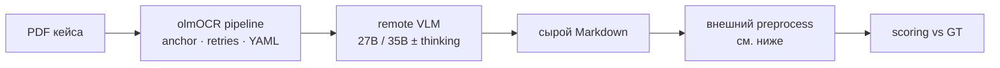

# E008 - olmOCR toolkit + self-hosted Qwen (27B / 35B)

## 1. Approach

На полном `ocr_benchmark` (24 кейса, тот же scoring contract, что E006/E007) —
**внешняя оболочка olmOCR** (Ai2 toolkit: render + document anchoring + retries)
с **self-hosted Qwen VLM**, а не с весами `olmOCR-2-7B-*`.

| Вариант | Модель | Thinking |
| --- | --- | --- |
| A | `Qwen/Qwen3.6-27B-FP8` | off |
| B | `Qwen/Qwen3.6-35B-A3B-FP8` | off |
| C | `Qwen/Qwen3.6-35B-A3B-FP8` | on |

Цель — ceiling «чужой VLM-OCR оболочки + наши развёрнутые VLM» относительно:

- dedoc `auto_tabby` (E006-B);
- тонкого page→Markdown VLM reader (E007 A/B/C на тех же моделях).

Ось: **оболочка + модель + thinking**, не обучение OCR-весов. Модели не
fine-tune под olmOCR; toolkit as-is с адаптером ответа (fence / language /
опционально `enable_thinking`), иначе pipeline массово режектит страницы.

### Preprocess перед scoring (вне snapshot contract)

Scorer не менялся. Перед записью `pred.raw.md` во внешнем адаптере:

| Шаг | Зачем (для extraction / реального Markdown) | Не цель |
| --- | --- | --- |
| Удалить `` | Плейсхолдеры без ассетов; для извлечения атрибутов шум | подогнать CER |
| HTML `<table>` → pipe | Контракт пайплайна и TEDS — pipe; HTML — та же извлечённая таблица в другом сериализаторе | «вылечить» layout |
| Снять YAML front matter olmOCR, если утекло в body | Служебные поля toolkit, не содержимое документа | —

**Сознательно не делаем:** починку ragged pipe, домысел rowspan/colspan,
переписывание prose под GT, выкидывание «лишних» секций. Flatten HTML
rowspan/colspan — lossy (текст якорной ячейки), это ограничение конвертера,
не попытка максимизировать TEDS.

### Известный пробел прогона

`extract-appendix-tech-2208215-p074`: olmOCR **discard** после 3 попыток —
модель уходит в гигантский LaTeX `\begin{tabular}` до `max_tokens` /
`finish_reason=length`, страница invalid. В snapshot — пустой pred (честный
факт «оболочка не выдала документ»), не синтетический fallback.

## 2. Expected effect / hypothesis

**Гипотеза:** оболочка olmOCR на generic Qwen не обязана бить тонкий E007
reader (тот же backbone без YAML/anchoring-контракта), но может выиграть там,
где важны anchoring / retries / reading order. На плотных таблицах риск
**форматного срыва** (HTML, LaTeX, truncate) выше, чем у pipe-prompt E007.

| Ожидание | Механизм | Критерий |
| --- | --- | --- |
| A vs E007-B | та же 27B | `token_f1` / `teds` vs E007-B |
| B vs A | 35B MoE сильнее на layout/tables | `teds` / hard-cases ↑ при близком text |
| C vs B | thinking снижает катастрофические срывы (discard / ragged) | меньше missing pred / `table_parse_error`; latency↑ |
| Catalog / multi-column | anchoring | `catalog-belimo` `teds` > 0 |
| Не «подогнать под метрики» | preprocess только формат | — |

**Adopt-сигнал:** устойчивый выигрыш над E007 на hard-scan/table при
приемлемом cost и без массовых discard. Если оболочка хуже thin reader на той
же модели — reject olmOCR-as-wrapper; ценность `olmOCR-2-7B` весов — отдельно.

## 3. Runs and metrics

Digest `a481aa528c94abc34e7298d0b1e26243bbc97600ff7cf3782c6e267caef6750c`,
`case_count=24`.

| Вариант | MLflow run_id | Key difference | missing pred | `cer` | `token_f1` | `teds` | `teds_s` | `ast` | `table_parse_error_count` |
| --- | --- | --- | ---: | ---: | ---: | ---: | ---: | ---: | ---: |
| A 27B | `a8c9eae237b34b27940e143cbcd1c81a` | thinking off | 1 | 0.807902 | 0.853990 | 0.410529 | 0.464209 | 0.587645 | 2 |
| B 35B | `52ae6ab617ed49da9308c831a2b80ca4` | thinking off | 9 | 0.571205 | 0.585377 | 0.573229 | 0.586821 | 0.426988 | 1 |
| C 35B | `d0fd28e889674a90883cdf0075bb98a3` | thinking on | 10 | 0.495368 | 0.531919 | 0.578556 | 0.611557 | 0.418347 | 1 |
| E007-B | `abe17b7e29df4e69b2eb72f9cf80647b` | thin VLM 27B | 0 | 0.842805 | 0.887527 | 0.611148 | 0.633080 | 0.573041 | 5 |
| E007-A | `a985e9052fd74f6bb86ff4bb81a16034` | thin VLM 35B think off | 0 | 0.844944 | 0.882720 | 0.637929 | 0.668315 | 0.597393 | 6 |
| E007-C | `c185a000b6864bce9817c58e054a863a` | thin VLM 35B think on | 0 | 0.855260 | 0.892131 | 0.667791 | 0.726672 | 0.707421 | 2 |
| E006-B dedoc | `c9758f22ded345e69e8bcb168fba4b52` | `auto_tabby` | 0 | 0.711665 | 0.812833 | 0.729071 | 0.797980 | 0.614975 | — |

Macro **all-24** у B/C занижен пустыми pred (discard). Conditional на
успешных кейсах (excl empty pred):

| | n | `token_f1` | `teds` | `cer` | `ast` |
| --- | ---: | ---: | ---: | ---: | ---: |
| A excl empty | 23 | 0.891 | 0.428 | 0.843 | 0.613 |
| B excl empty | 15 | 0.937 | 0.717 | 0.914 | 0.665 |
| C excl empty | 14 | 0.912 | 0.635 | 0.849 | 0.690 |

У B/C в all-24 часть `teds=1.0` на empty pred при GT без таблиц (3 и 5 кейсов)
— **надувает** headline `teds`; conditional надёжнее.

Snapshots: `…/bench_full/snapshot` (A), `…/bench_35b_nothink/snapshot` (B),
`…/bench_35b_think/snapshot` (C).

## 4. Interpretation

**A (27B):** text близок к E007-B; `teds` заметно слабее (см. разбор ниже /
ранее). Один discard.

**B/C (35B):** гипотеза «35B сильнее на tables» **не** читается по all-24 —
массовый discard (9–10/24) роняет `token_f1`/`cer` в ~0.5–0.6. Thinking (C)
**не** снизил failure rate vs B (оба ~34% failed pages, 14–15 md файлов);
набор выживших кейсов разный (C спас belimo/kur0130/appendix-tech; B сохранил
born-digital/bilingual).

На **успешных** кейсах B выглядит сильным (`token_f1≈0.94`, `teds≈0.72` на
n=15) — но это survivor bias (проще/удачные документы), не доказанный ceiling
над E007-A на полном корпусе. C excl empty чуть слабее B по text/tables.

**Статус:** olmOCR-as-wrapper на 35B **хуже** по надёжности формата, чем на
27B; thinking не чинит discard. Conditional quality интересный, но для
routing нужен полный корпус без 30%+ пустых pred.

## 5. Error analysis

### A (27B) — кратко

Один discard (`extract-appendix-tech`, LaTeX→length). Table gap vs E007 в
основном на живых pred (HTML/ragged/false-positive pipe), не на discard.
Полезный signal: heading/`#`-контракт и точечно rotation/belimo (детали в
предыдущей версии разбора A).

### B vs C (35B) — discard

Оба: **11 failed pages / 34%**, документы discard при
`fallback/pages > max_page_error_rate`.

| | missing pred (пустой) |
| --- | --- |
| B | belimo, kur0130, gost, sparse, purpose, mixed-scan, rotated, appendix-variants, appendix-tech (9) |
| C | born-digital, broken-tounicode, gost, handwritten, purpose, completeness, mixed-scan, bilingual×2, appendix-variants (10) |

Thinking **перераспределяет** срывы, не убирает: C впервые выдаёт
`extract-appendix-tech` и belimo/kur0130, но теряет born-digital и bilingual.
`standard-gost` и `mixed-scan` / `purpose` / `appendix-variants` ломаются в
обоих.

Корневая механика та же, что у A на appendix: invalid page после retries
(часто truncate / YAML), затем discard всего PDF. Preprocess тут не при чём —
markdown файла нет.

### B/C на выживших

Conditional `teds` выше A — но n=14–15 и другой состав кейсов; нельзя прямо
сравнивать с A-all-23 без matched subset. `table_parse_error_count=1` у обоих
(лучше A=2 на полном наборе, но меньше успешных табличных кейсов).

## 6. Conclusion

На generic Qwen оболочка olmOCR: **27B (A)** — единственный относительно
стабильный прогон (1 discard), text≈E007, tables слабее. **35B ± thinking
(B/C)** — ~⅓ страниц fail, 9–10 пустых pred; thinking не снижает failure rate.
Conditional метрики на survivors не оправдывают wrapper для полного бенча.
Спецвеса `olmOCR-2-7B-*` по-прежнему не оценены.

## 7. Decision

Reject olmOCR-as-wrapper на наших 27B/35B для routing (особенно 35B из‑за
discard). Забрать из A идеи heading-prompt / точечный rotation-pass в thin
VLM. Отдельный прогон только с `olmOCR-2-7B-*`, когда будут веса в контуре.
