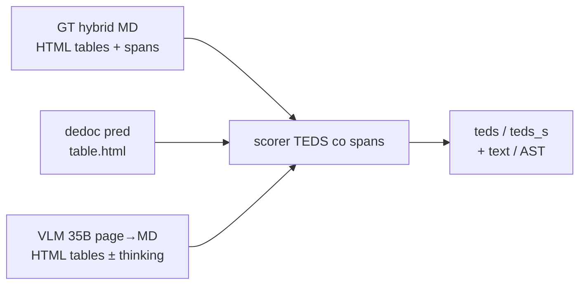

# E009 - HTML GT + scoring + VLM tables

## 1. Approach

Смена **контракта таблиц** в document-parsing: эталон и scoring переводятся с
pipe-markdown (flatten merges через `<!-- merged -->`) на **HTML-таблицы с
нативными `rowspan`/`colspan`**. Цель — честно измерить, даёт ли VLM с
HTML-выходом выигрыш над классическим parser’ом на таблицах, без lossy
flatten и без replay старых pipe-VLM прогонов ради сопоставимости headline.

Контекст: extraction уже ходит на HTML; у dedoc pred уже есть `table.html`
(`dedoc_table_to_html`). В document-parsing scoring до этого эксперимента
оставался pipe-ориентированным, поэтому TEDS не видел spans как часть дерева.

### Контракт эталона (GT)

- hybrid Markdown: prose + HTML `<table>`;
- spans только на origin-ячейке, без дубля текста в covered cells;
- все ячейки как `<td>` (без `thead`/`th`) — согласование с сериализацией
  dedoc, у которой нет надёжного header-сигнала в ячейках;
- переносы → пробел (без ` `); escape `&` / `<` / `>`; пустые —
  `<td></td>`;
- штамп / рамка / chrome — не таблица (как ignore-rules VLM).

### Scoring

- парсинг HTML-таблиц из hybrid MD;
- TEDS / TEDS-S на HTML **со spans** (без flatten merges);
- plain-text / AST / table counts — из тех же таблиц;
- математика TEDS та же; меняется эталонное дерево и путь каноникализации
  (`metric_contract_version` / `canonicalization_version` = `2.0`).

### Варианты на одном контракте

| Вариант | Что измеряется |
| --- | --- |
| A | **dedoc** `auto_tabby` + `each_page_textual_layer_detection` (pred HTML) — comparator baseline |
| B | **VLM HTML-arm**: self-hosted `Qwen/Qwen3.6-35B-A3B-FP8`, `enable_thinking: false` — page→MD с HTML-таблицами (тот же класс модели, что E007-A / `vlm_bench_35b`) |
| C | тот же VLM HTML-arm и та же 35B MoE, что B, но `enable_thinking: true` (trade-off latency / качество на сложном layout) |

Решение — сравнение **на одном** новом контракте (VLM-HTML ± thinking vs
dedoc-HTML), не строгая дельта к headline E007/E008 (там другой эталон /
flatten). Ось VLM: thinking on/off при фиксированном HTML-промпте и модели
`Qwen/Qwen3.6-35B-A3B-FP8`. Вариант 27B в E009 не входит (в отличие от E007-B).

Scope оценки: полный `ocr_benchmark` после promote переразмеченного GT и
нового digest; decision по table-heavy срезу на `teds` / `teds_s`.

Вне scope: тонкий тюнинг VLM-промпта / few-shot; page-join / across-pages;
extraction УКДИМ/НСИ; offline re-score старых pipe-VLM pred.

## 2. Expected effect / hypothesis

**Гипотеза:** на новом HTML+spans контракте VLM сможет честнее кодировать
merged cells и layout таблиц, чем pipe-путь E007; относительно **dedoc на том
же контракте** VLM не обязан выигрывать macro, но должен закрыть известные
дыры parser’а на сложных / scan / multi-column таблицах при контроле
born-digital guardrail. Thinking (C vs B) может подтянуть сложный layout /
снизить срывы HTML/spans ценой latency и токенов — как в E007-C на pipe.

| Ожидание | Механизм | Критерий |
| --- | --- | --- |
| Dedoc baseline сопоставим | pred уже HTML; scorer видит spans без flatten | стабильный `teds`/`teds_s` на table-кейсах; меньше артефактов «merge = пустая ячейка» |
| VLM vs dedoc на merges | 35B пишет origin-only rowspan/colspan | рост `teds` / `teds_s` на кейсах с merges vs A |
| Catalog / multi-column | HTML лучше pipe для сложного layout | `catalog-belimo` и table-heavy slice: `teds` заметно выше A или хотя бы > 0 при разумной структуре |
| Scan / sparse tables | vision читает сетку целиком | локальный выигрыш `teds`/`token_f1` на scan-срезах |
| Born-digital guardrail | лишний VLM-путь не обязателен при чистом text layer | без существенной регрессии prose/`token_f1` vs A на `born_digital_good` |
| C vs B (thinking) | больше «рассуждения» перед HTML-сериализацией | ↑ `teds`/`teds_s` или ↓ `table_parse_error` на hard/table без неприемлемого замедления; иначе default — thinking off |
| Не сравнивать headline с E007/E008 | другое дерево GT | ориентир только A/B/C внутри E009 |

**Adopt-сигнал:** на table-heavy срезе лучший из B/C устойчиво лучше A по
`teds` / `teds_s` при приемлемой регрессии текста и без массовых
`table_parse_error`. Thinking (C) — default только если заметный выигрыш над
B на hard-кейсах без неприемлемого cost. Если оба VLM-варианта хуже A или
паритет только ценой born-digital — reject VLM-HTML как универсальный table
path; ценность HTML-контракта для scoring/dedoc при этом может остаться
independently adopted.

## 3. Runs and metrics

Прогнаны **A / B / C** на одном HTML-GT digest
`dfb7c234e4a659a51e2462b7bdb0a6b1a301bee28419ad2ef60d0b6c350e0dc5`,
`case_count=24`, contract `2.0`.

| Approach / variant | MLflow run_id | Key difference | `cer` | `token_f1` | `teds` | `teds_s` | `ast` | `heading_f1` | `table_parse_error_count` | Notes |
| --- | --- | --- | ---: | ---: | ---: | ---: | ---: | ---: | ---: | --- |
| A dedoc HTML-GT | `760cd15b44bc4a70add3a7430132aef1` | `auto_tabby`+each_page | 0.825982 | 0.871270 | 0.748691 | 0.781341 | 0.595465 | 0.519444 | 0 | `dedoc-auto_tabby-html-gt` |
| B VLM 35B thinking off | `ab742cf667054c6385d066fb90f405de` | HTML prompt v1 | 0.814542 | 0.854023 | 0.557076 | 0.571601 | 0.558484 | 0.636111 | 3 | `E009-vlm-35b-dpi96-html-v1` |
| C VLM 35B thinking on | `d9e44c76ede04b87b332ee1385a62336` | + `enable_thinking: true` | 0.841124 | 0.870584 | 0.574033 | 0.590370 | 0.521779 | 0.408333 | 2 | `E009-vlm-35b-dpi96-html-v1-thinking`; snapshot `…-html-v1-thinking` |

Δ macro (один digest):

| | `token_f1` | `teds` | `teds_s` | `cer` | `ast` | `heading_f1` |
| --- | ---: | ---: | ---: | ---: | ---: | ---: |
| B − A | −0.0172 | −0.1916 | −0.2097 | −0.0114 | −0.0370 | +0.1167 |
| C − A | −0.0007 | −0.1747 | −0.1910 | +0.0151 | −0.0737 | −0.1111 |
| C − B | +0.0166 | +0.0170 | +0.0188 | +0.0266 | −0.0367 | −0.2278 |

Table-срез (`gt_count > 0`, n=16): mean `teds` A **0.623** / B **0.398** / C **0.424**.

## 4. Interpretation

**C не переворачивает решение vs A.** Thinking даёт небольшой плюс к B по
таблицам (`teds` +0.017 macro, +0.026 на table-срезе) и возвращает
`token_f1` к паритету с A (−0.001), но gap к dedoc остаётся большим
(`teds` C−A ≈ −0.17). Adopt-сигнал «VLM HTML устойчиво лучше A» — **нет**
ни для B, ни для C.

Относительно гипотезы C vs B: thinking **частично** помогает стабильности
формата (см. §5: снят pipe-runaway на completeness; born-digital снова
HTML), но **не** чинит ragged merges (tech/variants) и **не** закрывает
дыры catalog/rotated. Появляются новые провалы: пустой pred на
`catalog-belimo`, регресс `extract-materials` / `scan-tu` обратно в pipe.
`heading_f1` у C хуже и A, и B (−0.11 vs A) — thinking не бесплатен для
outline.

**Статус интерпретации.** A остаётся лучшим table comparator на HTML-GT.
C чуть лучше B, недостаточно для adopt. Thinking полезен как анти-loop /
анти-pipe на отдельных кейсах, не как table-quality gate. Дальше —
промпт/постпроцесс против pipe+ragged, не ожидание что thinking закроет
дыры; decision по VLM-HTML path скорее reject-or-iterate, не default.

## 5. Error analysis

Источники: A `760cd15b…`, B `ab742cf…`, C `d9e44c76…`; pred snapshots
`…-html-v1` и `…-html-v1-thinking`.

### Главный провал VLM: формат таблиц, не «невидимая сетка»

Scorer принимает **только** HTML `<table>`. Pipe в pred → `teds=0` даже
при живой сетке.

| case_id | B | C | Комментарий |
| --- | --- | --- | --- |
| `tu-born-digital-1062860-p010` | pipe → `teds` 0 | **HTML** → 0.938 | thinking починил контракт |
| `standard-gost-2195773-p006` | pipe → 0 | HTML, слабо (0.132) | формат лучше, качество сетки всё ещё низкое |
| `catalog-belimo-p020` | pipe → 0 | **пустой pred** (`"\n"`, tf1=0) | thinking хуже B: не pipe, а отказ |
| `extract-materials-…` | HTML → 1.0 | **pipe** → 0 | регресс C |
| `scan-tu-…` | HTML → 0.867 | **pipe** → 0 | регресс C |
| `extract-completeness-…` | pipe-**loop** | чистый prose | thinking снял runaway |

### Pipe runaway (B vs C vs E007)

| Snapshot | Runaway? | Кейс | Масштаб |
| --- | --- | --- | --- |
| E009-B | **да** | `extract-completeness-…` | streak **2173** × `| \| \| \| \| \|` |
| **E009-C** | **нет** | тот же | len≈2.8k, 0 pipe, `token_f1` 0.05→**0.99** |
| E007-A/C | нет на completeness | — | ~2.8k prose |

Thinking на E009 **закрыл** completeness-loop, который B открыл заново.
Других runaway (streak≥5) у C нет. Класс сбоя «pipe-loop» thinking умеет
гасить (как в E007-C на gost), но HTML-промпт сам по себе — нет.

### `table_parse_error` и целостность контекста

| case_id | B | C | Контекст |
| --- | --- | --- | --- |
| `extract-appendix-tech-…` | ragged (−1 col) | ragged (row 8, тот же класс) | HTML с почти полным клеточным текстом; demote → структура lost, текст ≈на месте |
| `extract-appendix-variants-…` | ragged оба frag | ragged оба frag | то же |
| `tu-mixed-text-scan-…` | ragged chrome | **нет parse_error**, но 2×HTML штампа → `pred/gt=2/0`, `teds` 0 | галлюцинация chrome; C не demote’ит, штрафует лишними таблицами |

**Открытая проверка** на extraction path (raw vs demote tech/variants) —
по-прежнему нужна; C её не снимает.

### Целевые дыры A

`catalog-belimo` / `tu-rotated`: `teds=0` у A/B/C. У C belimo ещё и
пустой документ — хуже для контекста, чем pipe-B.

### Где C лучше B (локально)

| case_id | Δ `teds` (C−B) | |
| --- | ---: | --- |
| `tu-born-digital-…` | +0.938 | pipe→HTML |
| `extract-appendix-params-…` | +0.606 | больше/лучше HTML-таблиц |
| `spec-kur0130` | +0.291 | 3 таблицы→1 |
| `web-krylak` | +0.266 | почти идеал |
| completeness (текст) | `token_f1` +0.94 | снят loop |

### Связь с интерпретацией

C чинит часть **сериализационных** провалов B (loop, born-digital HTML),
но macro table gap к A остаётся; ragged merges и catalog/rotated не
закрыты; плюс новые пустые/pipe-регрессы. Thinking — нестабильный
стабилизатор формата, не победитель table path.

## 6. Conclusion

Гипотеза «VLM-HTML ± thinking устойчиво лучше dedoc на том же HTML+spans
контракте» **не подтвердилась**: на table-срезе mean `teds` A **0.623** /
B **0.398** / C **0.424**; macro gap C−A по `teds` ≈ −0.17. Thinking (C)
частично стабилизирует формат (pipe-loop на completeness, pipe→HTML на
born-digital), но не закрывает ragged merges (tech/variants), дыры A
(catalog / rotated) и сам даёт регрессы (pipe на materials/scan-tu, пустой
pred на belimo). Главный класс сбоев VLM — **сериализация контракта**
(pipe / ragged → demote → структура lost при живом тексте), не «невидимая
сетка». Для extraction это критичнее TEDS: нет таблицы или demoted HTML —
атрибуты не в ячейках. HTML-контракт scoring/dedoc при этом остаётся
ценным независимо от VLM path.

## 7. Decision

**Reject** VLM-HTML как универсальный table path; **adopt** HTML+spans
контракт scoring и dedoc-A как table comparator. Следующий эксперимент —
улучшение VLM-промпта на full benchmark: HTML-only + пример таблицы (±
structured output / retry при pipe), чтобы снять format-noise; temperature
и thinking — только как анти-loop, не как table-quality gate. Параллельно —
универсальные правила маршрутизатора dedoc/OCR/VLM: default dedoc; VLM на
локальных выигрышах и дырах A (params-like, scan/mixed, krylak; catalog /
rotated — отдельный pre-step crop/rotate, не agent-MCP). Two-pass
prose/tables и тяжёлый tiling — после скелета router, точечно на fail-классах.
