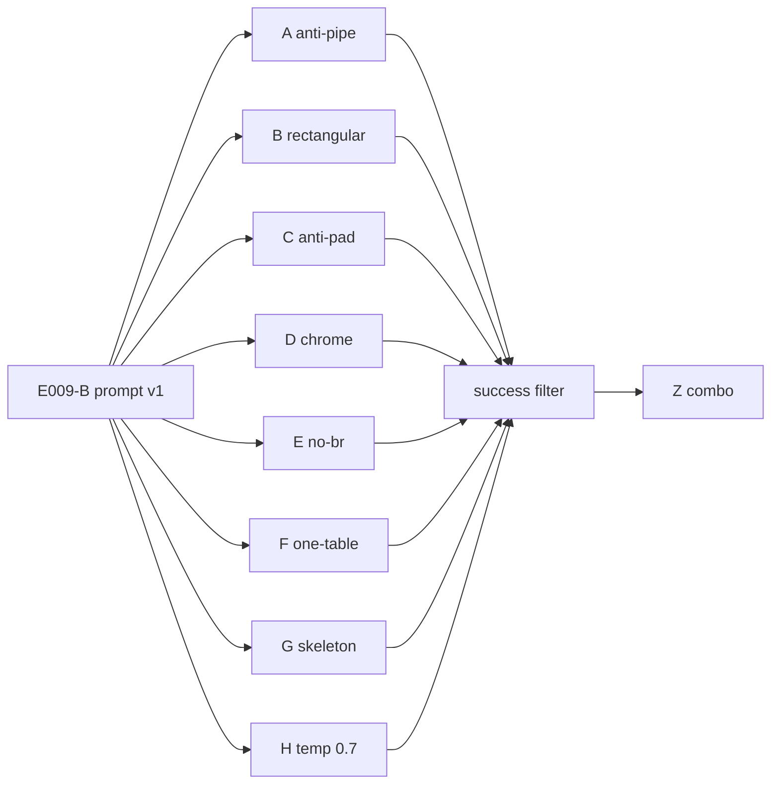

# E010 - VLM HTML prompt ablation

## 1. Approach

Абляция **отдельных правок HTML-промпта** VLM page→MD на том же контракте,
что E009 (hybrid Markdown + HTML `<table>`, spans, scoring `2.0`), против
фиксации E009-B (`enable_thinking: false`, `Qwen/Qwen3.6-35B-A3B-FP8`, dpi96,
полный `ocr_benchmark`, digest HTML-GT).

Базовый текст промпта — `e009-page-html-v1`. Каждый одиночный подход:
reset к baseline → **одно** изменение → **commit** `prompt.py` (чтобы
зафиксировать точный текст инструкции) → полный прогон → score. Затем комбо
только из правок, которые оправдали себя точечно (цель удара улучшилась и
нет заметного вреда в другом месте). Thinking / router вне scope; **H** —
единственный sampling-вариант (`temperature=0.7`).

| ID | Изменение | Целевая точка удара (E009) |
| --- | --- | --- |
| A | явный запрет pipe-таблиц (`\|…\|`) | pipe → `teds=0` при живой сетке |
| B | инвариант прямоугольности (учёт rowspan/colspan) | ragged → demote / parse_error |
| C | анти-padding: не дописывать пустые/повторные ряды | pipe-runaway / filler |
| D | chrome/штамп ≠ `<table>` даже при сетке | лишние таблицы из рамки |
| E | переносы в ячейке → пробел, без ` ` | cell whitespace / br-шум |
| F | одна визуальная сетка → один `<table>` | fragmentation сетки |
| G | один generic HTML-skeleton (rowspan/colspan) | format-noise / контракт |
| H | baseline-промпт + `temperature=0.7` (Qwen non-thinking; не greedy) | pipe-runaway / endless `|` loops |
| Z | комбо успешных одиночных | сумма полезных правок |

H — не правка текста промпта: исходный `e009-page-html-v1`, меняется только
sampling (`vlm_bench_35b` держит `temperature=0.0`). Значение `0.7` — официальная
рекомендация Qwen3 для non-thinking; они же предупреждают, что greedy decoding
может давать endless repetitions. `top_p`/`presence_penalty` в H не трогаем
(одно изменение).

Сравнение Δ — к E009-B (без перезапуска baseline). Критерий успеха
одиночного подхода ситуативный: улучшение в целевой точке без существенной
регрессии текста / других table-метрик.

## 2. Expected effect / hypothesis

**Гипотеза:** format-noise E009 (pipe, ragged, runaway, chrome-as-table)
снижается классовыми правилами промпта по отдельности; каждое правило
должно бить в свой класс сбоя без overfit и без взаимного исключения.
Thinking не нужен как table-quality gate. Комбо Z имеет смысл только если
хотя бы часть одиночных даёт локальный плюс без широкой регрессии.

| Подход | Ожидаемый эффект | Сигнал «оправдал себя» |
| --- | --- | --- |
| A | меньше pipe-pred → меньше `teds=0` от формата | ↑ `teds`/`teds_s` и/или меньше pipe-кейсов; без ↓ `token_f1` |
| B | меньше ragged HTML | ↓ `table_parse_error_count` и/или ↑ `teds` на merge-кейсах; без массового лома текста |
| C | нет runaway / padding | нет pipe-loop; `token_f1` не проседает на prose-heavy |
| D | меньше ложных таблиц из штампа | лучше table-count / `teds` на chrome-кейсах; без потери реальных таблиц |
| E | стабильнее cell text vs GT | ↑ text/table на кейсах с multiline-ячейками; без вреда spans |
| F | меньше дробления одной сетки | ближе `pred/gt` table counts; ↑ `teds` где была fragmentation |
| G | стабильнее HTML-сериализация | ↓ format-fails vs E009-B; без overfit на примере |
| H | срыв greedy pipe-loop без смены промпта | нет runaway на completeness-like; `token_f1`/`teds` не хуже E009-B существенно |
| Z | сумма успешных | лучше лучшего одиночного или паритет с меньшим format-noise; иначе не adopt комбо |

**Adopt-сигнал (промпт):** хотя бы одно правило устойчиво бьёт свою цель без
широкой регрессии; комбо Z — default-кандидат, если не хуже лучших
одиночных. Если все нейтральны/вредны — reject prompt-tweaks, оставить
E009-B текст + искать postprocess/router.

## 3. Runs and metrics

Baseline: E009-B `ab742cf667054c6385d066fb90f405de` (`E009-vlm-35b-dpi96-html-v1`).
Digest тот же `dfb7c234…`, `case_count=24`, contract `2.0`.

| Approach | MLflow run_id | Key difference | `token_f1` | `teds` | `teds_s` | `cer` | `ast` | `heading_f1` | `table_parse_error_count` |
| --- | --- | --- | ---: | ---: | ---: | ---: | ---: | ---: | ---: |
| E009-B | `ab742cf667054c6385d066fb90f405de` | prompt v1, T=0 | 0.854023 | 0.557076 | 0.571601 | 0.814542 | 0.558484 | 0.636111 | 3 |
| A anti-pipe | `b9f9882edf11446bb1ca76c9d49c24da` | forbid `\|` tables | 0.873332 | 0.596185 | 0.613268 | 0.842658 | 0.573242 | 0.686111 | 4 |
| B rectangular | `cf7d5fb3be3e4d4384e952136d67a1fb` | row-width invariant | 0.854263 | 0.515548 | 0.529934 | 0.826927 | 0.526960 | 0.650000 | 2 |
| C anti-padding | `77738cba14594d8faeea7200b48afe35` | no filler rows | 0.833110 | 0.515455 | 0.529934 | 0.805839 | 0.544375 | 0.636111 | 2 |
| D chrome≠table | `0a7d797fe5dc40e8b5b97e87b3bbf49a` | stamp not `<table>` | 0.839411 | 0.512362 | 0.526848 | 0.825514 | 0.545080 | 0.677778 | 2 |
| E no-br | `bb5986b463dc40b29db486f73bcf3264` | collapse cell breaks | 0.862586 | 0.520437 | 0.535968 | 0.831213 | 0.547884 | 0.643056 | 2 |
| F one-table | `27f58ab0427a49ab82b1d92451edf9c9` | one grid → one table | 0.912634 | 0.557224 | 0.571601 | 0.892894 | 0.486351 | 0.629167 | 6 |
| G skeleton | `dbc77833e0364be997a9e6c449c27e33` | HTML shape example | 0.906580 | 0.575553 | 0.600346 | 0.875227 | 0.616970 | 0.636111 | 3 |
| H temp 0.7 | `8dacc28a365b4842bf9525481a505845` | baseline + T=0.7 | 0.892947 | 0.601398 | 0.615768 | 0.867282 | 0.584415 | 0.546474 | 3 |
| Z combo A+G+H | `193875cad49a4976bc969ad2e4a28573` | anti-pipe+skeleton, T=0.7 | 0.912020 | 0.565576 | 0.580860 | 0.901264 | 0.582059 | 0.583333 | 3 |
| Adopt G+H | `f08dd1dd66ac4c49ae8498dc874d2d7c` | skeleton + T=0.7 (без A) | 0.917539 | 0.569114 | 0.580129 | 0.893219 | 0.583139 | 0.595833 | 3 |

Δ vs E009-B (macro):

| | Δ `token_f1` | Δ `teds` | Δ `teds_s` | Δ `table_parse_error` | Δ `heading_f1` |
| --- | ---: | ---: | ---: | ---: | ---: |
| A | +0.0193 | +0.0391 | +0.0417 | +1 | +0.0500 |
| B | +0.0002 | −0.0415 | −0.0417 | −1 | +0.0139 |
| C | −0.0209 | −0.0416 | −0.0417 | −1 | 0 |
| D | −0.0146 | −0.0447 | −0.0448 | −1 | +0.0417 |
| E | +0.0086 | −0.0366 | −0.0356 | −1 | +0.0069 |
| F | +0.0586 | +0.0001 | 0 | +3 | −0.0069 |
| G | +0.0526 | +0.0185 | +0.0287 | 0 | 0 |
| H | +0.0389 | +0.0443 | +0.0442 | 0 | −0.0896 |
| Z | +0.0580 | +0.0085 | +0.0093 | 0 | −0.0528 |
| Adopt G+H | +0.0635 | +0.0120 | +0.0085 | 0 | −0.0403 |

## 4. Interpretation

По macro table-метрикам выделяются **A**, **G**, **H** (↑ `teds`/`teds_s` и
↑ `token_f1`). Остальные либо роняют `teds` (B/C/D/E), либо дают плоский
`teds` ценой роста `table_parse_error` (F).

Ситуативно (цель удара):

- **A** бьёт pipe→HTML на `tu-born-digital` (`teds` 0→0.935); macro растёт;
  completeness-runaway **не** снят; `table_parse_error` +1.
- **B** снижает parse_error (3→2), но `teds` −0.04 — цена выше выигрыша;
  pipe-кейсы не чинит.
- **C** не гасит completeness-loop и ухудшает text/tables; на gost даже
  раздувает pipe — reject.
- **D** не убирает chrome-as-table на mixed и роняет macro tables — reject.
- **E** локально тянет gost к HTML, но macro `teds` ниже baseline — reject.
- **F** гасит completeness-runaway по тексту, но `parse_error` 6 и `teds`
  паритет; fragmentation (kur0130 3 таблицы) не сдвинута — не в комбо.
- **G** как A поднимает born-digital; плюс чинит completeness `token_f1`
  0.05→0.98 (с побочным pred_table=1 при gt=0); macro ↑.
- **H** лучший одиночный `teds`; чинит completeness без лишней таблицы;
  впервые даёт HTML на `catalog-belimo` (`teds` 0→0.802); `heading_f1` −0.09.

**В комбо Z:** A + G (промпт) + H (`temperature=0.7`). B–F не тащим.

**Статус интерпретации (после Z).** Z даёт лучший `token_f1` (+0.058), но
`teds` только +0.009 vs E009-B и **ниже** лучших одиночных A (+0.039) и H
(+0.044). Комбо не аддитивно: на belimo пропадает выигрыш H (снова нет
HTML-таблицы); born-digital и completeness держатся. Итого — рычаги
подтверждены по отдельности, полный A+G+H как default не оправдан.

**Adopt G+H (без A)** `f08dd1dd…`: лучший `token_f1` (+0.064), `teds` +0.012
— чуть лучше Z, всё ещё ниже одиночных A/H по tables. Born-digital HTML и
completeness без loop/без ложной table держатся; belimo снова pipe (как у G,
не как у H). Anti-pipe в стеке не нужен для этого профиля.

## 5. Error analysis

Фокус-кейсы E009 (pipe / runaway / chrome / merges):

| case | E009-B | A | G | H | Z | Adopt G+H | Комментарий |
| --- | --- | --- | --- | --- | --- | --- | --- |
| `tu-born-digital` | pipe, teds 0 | **HTML 0.935** | **HTML 0.935** | pipe 0 | **HTML 0.935** | **HTML 0.919** | G/Z/adopt |
| `standard-gost` | pipe 0 | HTML+pe 0 | HTML 0.106 | pipe 0 | HTML+pe 0 | HTML+pe 0 | формат лучше, сетка слабая |
| `catalog-belimo` | pipe 0 | pipe 0 | pipe 0 | **HTML 0.802** | нет table 0 | pipe 0 | только H |
| `extract-completeness` | runaway, tf1 0.05 | runaway | **tf1 0.98** (+ложная table) | **tf1 0.96**, pred=0 | **tf1 0.96**, pred=0 | **tf1 0.96**, pred=0 | G/H/Z/adopt |
| tech / variants | pe | pe | pe | pe | pe | pe | merges не закрыты |
| `tu-mixed` chrome | pe | teds 0 | teds 1 | teds 1 | teds 0 | (см. pe) | D не помог |
| `spec-kur0130` | 0.112 | 0.112 | 0.112 | 0.112 | (не сдвинут) | (не сдвинут) | F не помог |

Итог по классам: **pipe-format** → A/G/Z/adopt; **runaway** → G/H/Z/adopt
(не C); **catalog layout** → только H; **ragged merges / chrome /
fragmentation** — одиночными правилами не закрыты. Z и adopt G+H не
сохраняют belimo-выигрыш H.

## 6. Conclusion

Часть гипотезы подтвердилась: против format-noise E009-B работают **G**
(HTML-skeleton) и **H** (`temperature=0.7`) — меньше pipe/runaway и выше
`token_f1`/`teds` на своих точках удара. **A** тоже поднимал pipe→HTML, но
runaway не снимал; B–F не оправдали цель или вредны. Полный стек Z не лучше
лучших одиночных по `teds` и теряет belimo-выигрыш H. Контрольный прогон
**adopt G+H** (без A) даёт лучший `token_f1` (+0.064) и скромный `teds`
(+0.012): анти-loop + HTML-якорь без anti-pipe — достаточный default для
контекста чанков/поиска/extraction.

## 7. Decision

**Adopt** для VLM HTML-path: промпт **G** (`e010-skeleton`) и
**`temperature=0.7`** на `vlm_bench_35b` (подтверждено прогоном
`E010-vlm-35b-dpi96-skeleton-t07`). **Reject** B–F, anti-pipe как
обязательный default и комбо Z. Дальше — router/postprocess на
merges/chrome, не наращивание system-prompt.
