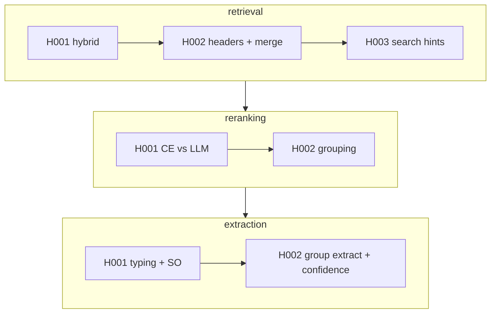

# Research steps

## Order of steps

1. `ocr`
2. `markdown_formatting`
3. `chunking`
4. `vectorizing`
5. `retrieval`
6. `merge`
7. `attribute_grouping`
8. `reranking`
9. `context_grouping`
10. `context_rebuild`
11. `extraction`

## Исторический пилот (`history/H00x`)

Журналы в `eval/experiments/history/` шагов — ключевые решения пилота (ТУ/ТЗ → атрибуты). Нумерация **локальна для шага**. Не live MLflow-replay; текущие `E00x` — отдельная линия.

| Шаг | Journals |
| --- | --- |
| `retrieval` | [history/](./retrieval/eval/experiments/history/) — H001…H003 |
| `reranking` | [history/](./reranking/eval/experiments/history/) — H001…H002 |
| `extraction` | [history/](./extraction/eval/experiments/history/) — H001…H002 |

### Итоговые метрики пилота

| Метрика | Баки | Теплообменники | Фильтры сетчатые | Средневзвешенное | Цель |
| --- | ---: | ---: | ---: | ---: | ---: |
| Automation Rate | 78,47% | 69,79% | 72,75% | **74,30%** | ≥ 55% |
| Net Effect | 0,41 | 0,28 | 0,43 | **0,37** | ≥ 0,2 |
| NPV | 85,36% | 82,55% | 82,55% | **83,85%** | ≥ 60% |
| NPV @ high confidence | 90,86% | 87,87% | 91,67% | **90,04%** | ≥ 90% |

Детали и вердикты — в journals; бизнес-итог также в `extraction` history H002.
