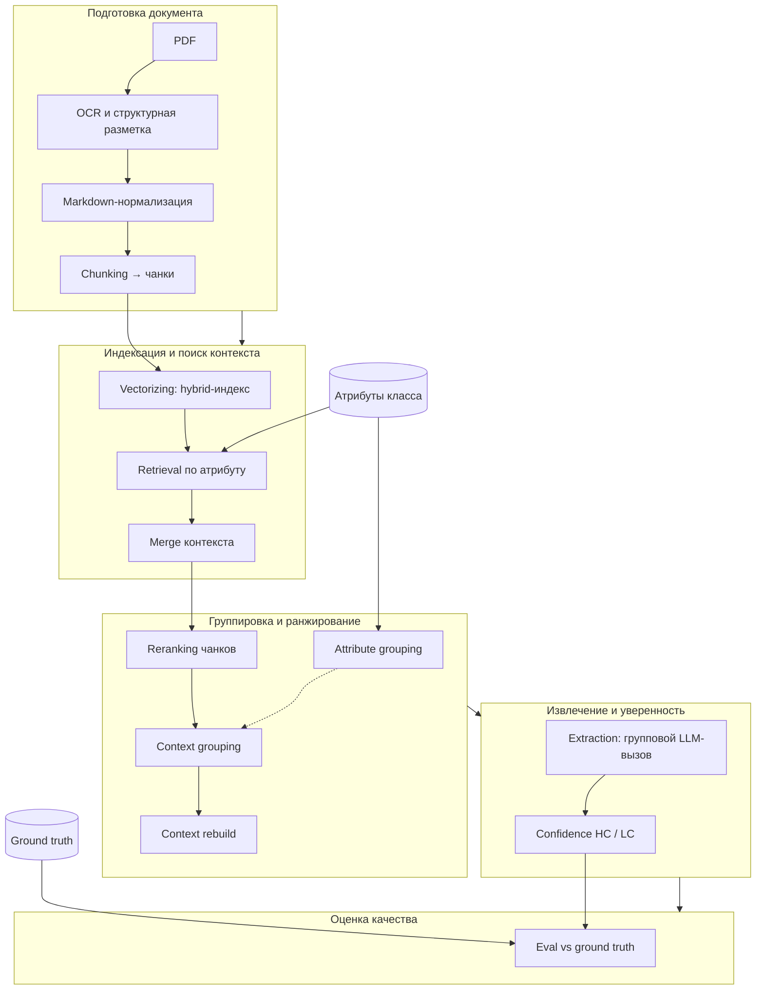
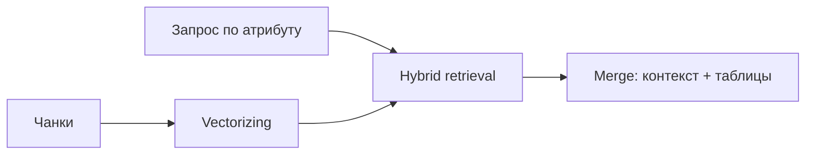
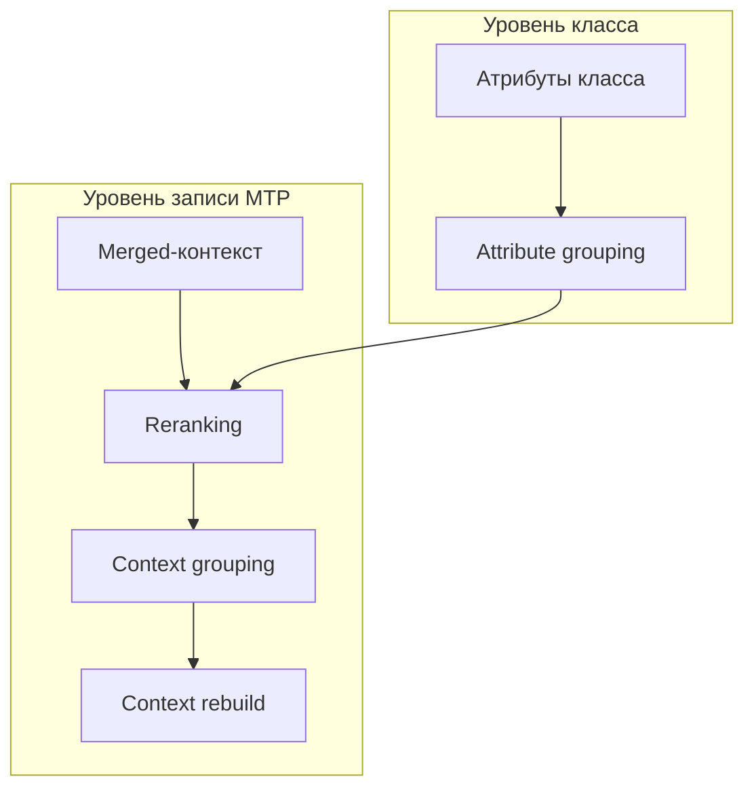
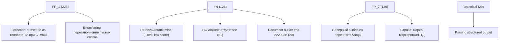

# E001 - Baseline: RAG-пайплайн извлечения атрибутов НСИ

## 1. Approach

Baseline фиксирует текущую end-to-end цепочку автоматического извлечения атрибутов записи МТР из PDF-документов технических условий при **заранее известном классе**. Задача — по набору атрибутов класса и приложенным PDF вернуть для каждого атрибута значение (или явное отсутствие), бинарную оценку уверенности и опорный фрагмент текста.

### Оцениваемый объём данных

| Параметр                                | Значение                                                   |
| --------------------------------------- | ---------------------------------------------------------- |
| Класс МТР                               | `18010107` (клапаны запорные)                              |
| Записей МТР (`eos_id`)                  | 17                                                         |
| Атрибутов класса                        | 76, из них в scope извлечения (`for_extraction=true`) — 73 |
| Слотов eval (пара `eos_id` × `attr_id`) | 1242                                                       |
| Формат документов                       | PDF с текстовым слоем (ТУ, паспорта, приложения к ТЗ)      |

Ground truth берётся из НСИ; пустые значения — JSON `null`. Eval universe строится только по атрибутам с `for_extraction=true`: для каждого такого слота должна существовать GT-строка.

### Архитектура пайплайна

Пайплайн организован в **четыре зоны ответственности** плюс внешняя оценка. Поток не строго линейный: группировка атрибутов выполняется на уровне класса, остальные этапы — на уровне записи МТР; поиск и отбор контекста идут **по каждому атрибуту**, извлечение — **по группе атрибутов**.

**Подготовка документа**

1. **OCR и структурная разметка** — dedoc с кастомными паттернами для документов формата ТЗ/ТУ (типы строк, заголовки, подписи таблиц).
2. **Markdown formatting** — детерминированное преобразование дерева dedoc в компактный markdown: структурный текст и таблицы обрабатываются отдельно.
3. **Chunking** — разбиение на structure- и table-чанки с лимитом 512 токенов (минимум 128); длинные фрагменты делятся по tokenizer embedder-модели.

**Индексация и поиск контекста**

1. **Vectorizing** — hybrid-индекс в Qdrant на каждый `eos_id`: dense-эмбеддинги (`deepvk/USER-bge-m3`) + sparse BM25 (русский язык). Одна коллекция на запись МТР.
2. **Retrieval** — гибридный поиск (dense + client-side BM25, RRF) **по каждому атрибуту**; запрос строится из наименования атрибута, при наличии — с суффиксом варианта исполнения. Top-10 чанков на атрибут.
3. **Merge** — сборка контекстных блоков из search hits: structure-чанки дополняются связанными table-чанками через placeholder-ы таблиц.

**Группировка и ранжирование**

1. **Attribute grouping** (на уровне класса) — семантическое разбиение 73 атрибутов на группы для совместного извлечения: tight groups по косинусному сходству эмбеддингов (порог 0.9) + LLM-партиционирование остатка. Размер группы 2–5, максимум 30 атрибутов в одной LLM-партиции.
2. **Reranking** — LLM-оценка релевантности каждого merged chunk для **каждого атрибута** по детерминированному чеклисту (наличие имени атрибута, связь значения, единицы измерения, неоднозначность). Top-5 чанков на атрибут; при сбое — fallback top-10 в исходном порядке.
3. **Context grouping** (на уровне `eos_id`) — уточнение групп атрибутов по фактическому пересечению source chunks из rerank (Jaccard merge, порог 0.5).
4. **Context rebuild** — пересборка финального контекста для каждой группы: объединение rerank-evidence в section-level блоки из Qdrant.

**Извлечение и уверенность**

1. **Extraction** — групповое structured extraction через LLM (`Qwen/Qwen3.6-35B-A3B-FP8`, temperature 0, seed 42). Атрибуты одной группы извлекаются за один вызов из общего контекста. Промпт требует точного совпадения по label, конкурентного назначения значений между атрибутами группы и null safety.
  **Оценка уверенности (HC/LC)** — постобработка на основе rerank score:
  - для **непустого** значения: HC, если score ≥ 1.0, в тексте есть точное имя атрибута и второй по score chunk существенно слабее (< 0.5);
  - для **пустого** значения: HC, если лучший rerank score < 0.5 (консервативная интерпретация отсутствия).
  Поддерживаются типы атрибутов НСИ: строка, целое/вещественное число, диапазон, список, набор значений; учитываются допустимые ЕИ и enum-значения, hints из `descr`, варианты исполнения.

### Модели и инфраструктура

| Компонент      | Модель / сервис                                |
| -------------- | ---------------------------------------------- |
| Extraction LLM | `Qwen/Qwen3.6-35B-A3B-FP8`                     |
| Grouping LLM   | `Qwen/Qwen3.6-35B-A3B-FP8`                     |
| Rerank LLM     | `Qwen/Qwen3.6-35B-A3B-FP8` (thinking disabled) |
| Dense embedder | `deepvk/USER-bge-m3`                           |
| Vector store   | Qdrant (hybrid dense + BM25)                   |

### Что измеряется

Eval сравнивает extraction output с ground truth по каждому слоту `(eos_id, attr_id)`:

| Метка  | Условие                                             |
| ------ | --------------------------------------------------- |
| `TP`   | GT непусто, prediction непусто, значения совпали    |
| `TN`   | GT пусто, prediction пусто                          |
| `FP_1` | GT пусто, prediction непусто (ложное извлечение)    |
| `FP_2` | GT непусто, prediction непусто, значения не совпали |
| `FN`   | GT непусто, prediction пусто (пропуск)              |

Confidence отдельно: `HC` / `LC` по полю `high_confidence`.

Matching — детерминированные comparators (числа, диапазоны, enum, строки с edit-distance tolerance); для сложных строк — LLM-as-judge. Сопоставление единиц измерения в eval временно отключено (`unit_matching_enabled=false`).

Headline-метрика eval: `accuracy = (TP + TN) / count` — эквивалент **Automation_Rate** из методики пилота. Дополнительно считаются `hc_accuracy`, `lc_accuracy`, доли TP/TN/FP/FN, `errors` (технические сбои extraction).

## 2. Expected effect / hypothesis

Baseline не проверяет конкретное улучшение — он **фиксирует отправную точку** для всех последующих экспериментов.

**Гипотеза baseline:** текущая RAG-цепочка (hybrid retrieval → LLM rerank → групповое extraction с rerank-based confidence) на классе `18010107` даёт **измеримый и воспроизводимый** уровень качества, достаточный для:

1. **Сравнения** с целевыми показателями пилота:
  - Automation_Rate (`accuracy`) ≥ 55%
  - NPV (`TN / (TN + FN)`) ≥ 60%
  - NPV@high_confidence ≥ 90%
  - Net_Effect ≥ 0.3 (пока не считается автоматически в eval, но derivable из label-распределения и временной модели)
2. **Диагностики** слабых мест — через разбивку по `FP_1` (галлюцинации), `FP_2` (ошибки значений), `FN` (пропуски), `TN`/`FN` с HC/LC (качество определения отсутствия).
3. **Калибровки confidence** — проверка, что `hc_accuracy` существенно выше `lc_accuracy`, то есть HC-метка коррелирует с фактической точностью и может сокращать объём ручной проверки.

**Ожидаемый профиль ошибок (качественно, без чисел):**

- `FP_1` — преимущественно на атрибутах с семантически близкими соседями или при слабом rerank evidence;
- `FN` — когда значение есть в документе, но retrieval/rerank не доставил нужный chunk в контекст группы;
- `FP_2` — нормализация чисел/единиц, OCR-шум, неоднозначные формулировки в таблицах;
- низкий `hc_rate` при приемлемом `accuracy` — confidence слишком консервативен;
- высокий `hc_rate` при низком `hc_accuracy` — confidence переоценивает надёжность.

Baseline считается установленным после первого полного прогона пайплайна и eval на всём manifest (17 записей, 1242 слота) с логированием в MLflow.

## 3. Runs and metrics

| Подход / вариант           | MLflow run_id                      | Ключевое отличие                  | Релевантные метрики | Примечания                                                                                                                                                     |
| -------------------------- | ---------------------------------- | --------------------------------- | ------------------- | -------------------------------------------------------------------------------------------------------------------------------------------------------------- |
| Baseline (полный manifest) | `572088fae3f24f45a0fafa9b89fda5b1` | Текущая RAG-цепочка без изменений | см. ниже            | experiment `7`, run name `baseline`, status `FINISHED`, commit `faaf8169`, source `research/steps/extraction/output`, GT digest `2ab99836` (1242 rows в input) |

**Headline и целевые метрики пилота**

| Метрика                      | Значение                     | Источник                                        |
| ---------------------------- | ---------------------------- | ----------------------------------------------- |
| `accuracy` (Automation_Rate) | 61.16%                       | MLflow                                          |
| `count`                      | 1241                         | MLflow                                          |
| `errors`                     | 29                           | MLflow                                          |
| NPV = `TN / (TN + FN)`       | 83.55% (640 / 766)           | derived: `tn_count` / (`tn_count` + `fn_count`) |
| NPV@high_confidence          | *не залогировано*            | —                                               |
| Net_Effect                   | *не считается автоматически* | —                                               |

**Распределение label-ов**

| Метрика                  | rate   | count |
| ------------------------ | ------ | ----- |
| `tp_rate` / `tp_count`   | 9.59%  | 119   |
| `tn_rate` / `tn_count`   | 51.57% | 640   |
| `fp1_rate` / `fp1_count` | 18.21% | 226   |
| `fp2_rate` / `fp2_count` | 10.48% | 130   |
| `fn_rate` / `fn_count`   | 10.15% | 126   |

**Confidence**

| Метрика       | Значение |
| ------------- | -------- |
| `hc_rate`     | 36.26%   |
| `lc_rate`     | 63.74%   |
| `hc_accuracy` | 84.44%   |
| `lc_accuracy` | 47.91%   |

Проверка: `tp_count + tn_count + fp1_count + fp2_count + fn_count = 1241 = count`. Eval universe в run input — 1242 GT rows; расхождение на 1 слот между input dataset и `count` требует уточнения (не блокирует чтение агрегатов).

## 4. Interpretation

**Наблюдаемые значения.** Baseline eval на классе `18010107` дал `accuracy` 61.16% на 1241 слоте. Доля корректных отсутствий (`TN`) — 51.6% всех слотов; recall по непустому GT (`TP / (TP + FN)`) — 48.6% (119 / 245). Ошибки распределены между `FP_1` (18.2%), `FP_2` (10.5%) и `FN` (10.2%); `FP_1` — крупнейший компонент среди ошибочных label-ов. Технических сбоев extraction — 29 (2.3% от `count`).

**Сравнение с гипотезой и целями пилота.**

- **Automation_Rate:** 61.16% ≥ 55% — порог пилота выполнен.
- **NPV:** производная 83.55% ≥ 60% — порог выполнен; модель в агрегате хорошо определяет отсутствие значения среди слотов, где GT пуст или prediction пуст (TN + FN universe).
- **NPV@high_confidence:** проверить нельзя — в run нет HC-разбивки TN/FN; нужны slice-метрики или артефакт `rows.jsonl`.
- **Net_Effect:** проверить нельзя — метрика не логируется и не выводится из доступных scalar metrics без временной модели.

**Калибровка confidence.** `hc_accuracy` (84.44%) существенно выше `lc_accuracy` (47.91%), разрыв ~36.5 п.п. Это согласуется с ожиданием, что HC-метка коррелирует с фактической точностью. При `hc_rate` 36.3% roughly треть предсказаний помечена как высоконадёжная — умеренный, не крайне консервативный профиль; однако без HC-specific NPV нельзя судить, достигает ли HC-фильтр целевых 90% по отсутствиям.

**Trade-offs и неожиданности.**

- Высокий `TN_rate` и высокий `fp1_rate` сосуществуют: pipeline часто корректно оставляет пустые слоты пустыми, но при этом `FP_1` — доминирующий тип ошибки (~46% всех non-TN/TP слотов: 226 / 482). Это может указывать на склонность к ложным извлечениям, но причину (rerank, grouping, extraction) агрегаты не подтверждают.
- `FN` и `FP_2` близки по rate (~10%), что не выделяет один явный вторичный провал на уровне метрик.
- `count` = 1241 при ожидаемых 1242 слотах — небольшое расхождение; стоит сверить manifest/GT coverage, но на headline-метрики влияние минимально.

**Статус интерпретации.** По доступным scalar metrics baseline **измерим и воспроизводим**: ключевые пороги пилота по `accuracy` и NPV выполнены, HC/LC разделение по точности выраженное. Не подтверждено: NPV@high_confidence, Net_Effect, причины доминирования `FP_1`. Для уточнения нужны error analysis (`rows.jsonl`, error artifacts) и HC-slice метрики — до этого финальный вывод о пригодности baseline для production-подобного использования преждевременен.

## 5. Error analysis

Источник: артефакты eval run (`rows.jsonl`, `errors/*.json`) — 1241 строка, 17 `eos_id` × 73 атрибута. Расхождение с ожидаемыми 1242 слотами объясняется полным покрытием 17 записей без «лишнего» слота в артефакте; на паттерны ошибок не влияет.

### Доминирование `FP_1`: галлюцинации vs потенциально неполный GT

`FP_1` (226 слотов, 26.1% среди пустого GT) — главный источник ошибок. Для уточнения причин выборочно сопоставлены `raw_quote` и `pred_value` с **фактическими входными чанками** из `context_rebuild/output/{eos_id}_extraction_context.json` (тот же контекст, что видит extraction). Полный разбор всех 226 случаев не делался; ниже — только случаи с высокой уверенностью в классификации.

**Агрегатный профиль (без изменений):**

| Наблюдение     | Данные                                                          |
| -------------- | --------------------------------------------------------------- |
| Типы атрибутов | `enum` 96, `string` 45, `number` 35, `range` 30, `enum_list` 20 |
| Confidence     | 221 `LC`, 5 `HC`                                                |
| `raw_quote`    | 226/226                                                         |
| Rerank score   | avg 0.71; ≥ 1.0 у 94 (42%)                                      |

**Грубая оценка по grounding в контексте** (эвристика по подстроке quote/pred в чанках группы; пограничные случаи с OCR-шумом могли попасть в соседний класс):

| Группа                                            | ~доля | Смысл                                                          |
| ------------------------------------------------- | ----- | -------------------------------------------------------------- |
| Pred и quote есть в чанках, значение конкретное   | ~45%  | Скорее **потенциально неточный/неполный GT**, чем галлюцинация |
| Quote в чанках, pred выведен/додуман              | ~30%  | Интерпретация или выбор из перечня — спорный `FP_1`            |
| Типовые требования ТЗ (комплектность, установка…) | ~15%  | Текст есть, но это шаблон, не факт по записи                   |
| Quote/pred не подтверждаются чанками              | ~10%  | Ближе к **реальной галлюцинации** или ошибке чтения таблицы    |

**Уточнение первоначальной интерпретации:** высокий rerank и наличие `raw_quote` у всех `FP_1` не означают автоматически «ложное извлечение». В значительной части случаев модель цитирует фрагмент, который **буквально присутствует во входном контексте**, тогда как GT в `ground_truth.jsonl` остаётся `null`. Eval честно считает это `FP_1`, но для диагностики пайплайна часть таких слотов выглядит как пропуски разметки, а не как сбой extraction.

#### Примеры: pred, похоже, корректен — GT потенциально требует уточнения

| eos_id  | Атрибут                                          | Pred                                 | `section_id` | `raw_quote` (фрагмент)                                           |
| ------- | ------------------------------------------------ | ------------------------------------ | ------------ | ---------------------------------------------------------------- |
| 2203020 | Строительная длина арматуры                      | `200`                                | 10           | `Строительная длина, мм                                          |
| 2203020 | Производитель/Торговая марка                     | `ООО «НефтеХимИнжиниринг»`           | 9            | `Предприятие-изготовитель: ООО «НефтеХимИнжиниринг»`             |
| 2203020 | Материал уплотнения в затворе                    | `фторопласт`                         | 15           | `                                                                |
| 2203020 | Обозначение документа на разработку/изготовление | `ТУ 3742-001-09212465-2016`          | 3            | `(ТУ 3742-001-09212465-2016)`                                    |
| 2203009 | Производитель/Торговая марка                     | `ООО «БОЛОГОВСКИЙ АРМАТУРНЫЙ ЗАВОД»` | 0            | `ООО «БОЛОГОВСКИЙ АРМАТУРНЫЙ ЗАВОД»`                             |
| 2203009 | Обозначение документа на разработку/изготовление | `ТУ 3712-001-04606952-2011`          | 1            | `по ТУ 3712-001-04606952-2011`                                   |
| 2202460 | Температура расчетная                            | `[335, 335]`                         | 1491         | `Tp 335 - расчетная температура Tp, °C`                          |
| 2205987 | Производитель/Торговая марка                     | `ЗАО «Кургантеплоарматура»`          | 0            | `3AO «KyprattcITeu;apArmatura»` (OCR-слой; модель нормализовала) |

Общий паттерн: **паспорт / СК / титульный лист** — поля, которые в документе заполнены явно, но в НСИ для записи не проставлены. При этом другие атрибуты той же записи (например, класс безопасности `4`) в GT есть.

#### Примеры: реальные или близкие к галлюцинации

| eos_id  | Атрибут                               | Pred         | `raw_quote` (фрагмент)                           | Почему скорее ошибка модели                             |
| ------- | ------------------------------------- | ------------ | ------------------------------------------------ | ------------------------------------------------------- |
| 2215558 | Максимальная габаритная ширина        | `[136, 716]` | `                                                | 0                                                       |
| 2202460 | Сигнализация положения                | `нет`        | `…датчик положения (по требованию заказчика)`    | Слова «нет» в контексте нет; выведено из опциональности |
| 2202460 | Классификация арматуры по НП-068-2005 | `2ВIIа`      | `…арматуры 2 и 3 классов безопасности…`          | Кода `2ВIIа` в цитате нет                               |
| 2202460 | Категория обеспечения качества        | `QA2`        | `Категория обеспечения качества QA2, QA3 и QNC…` | Выбор одного значения из перечня без привязки к заказу  |

#### Пограничные: текст в документе есть, но `FP_1` с точки зрения задачи оправдан

- **Комплектность поставки** (`eos_id=2202460`) — дословный фрагмент раздела «В комплект поставки должны входить…» из ТЗ; в GT `null`, потому что это типовой перечень требований, а не фактическая комплектация конкретной поставки.
- **Установочное положение / направление подачи** — стандартные формулировки ТУ, часто относящиеся ко всему классу клапанов, а не к выбранному исполнению.

#### Вывод по `FP_1`

Картина смешанная: значительная доля `FP_1` подкреплена конкретным фрагментом входного контекста и может отражать неполноту GT; другая доля — типовые требования ТУ или неверный выбор из перечня (нужен null safety); меньшинство — явные ошибки интерпретации. Имеет смысл аудит GT на подмножестве с подтверждённым grounding, прежде чем закладывать всё снижение `FP_1` в доработку extraction.

### PDF с наложенным OCR text layer

Среди 17 PDF в manifest только **2 файла** (один и тот же ТУ, две записи МТР) имеют наложенный OCR-слой: `Producer: Adobe Acrobat Pro … Paper Capture Plug-in`. Извлекаемый текстовый слой **не содержит кириллицы** — кириллица заменена латинскими homoglyph-ами и шумом.

| eos_id  | PDF                                 | Признак OCR-слоя                                  |
| ------- | ----------------------------------- | ------------------------------------------------- |
| 2205987 | `ТУ 3742-011-62603588-2010.pdf`     | Paper Capture; 0 строк с кириллицей в `pdftotext` |
| 2237049 | `ТУ 3742-011-62603588-2010 (2).pdf` | то же (дубликат файла)                            |

Остальные 15 PDF — нормальный текстовый слой с читаемой кириллицей в пайплайне.

**Сравнение метрик** (146 vs 1095 слотов):

| Группа                     | `accuracy` | `FP_1`    | `FN`      | `FP_2` | `technical` |
| -------------------------- | ---------- | --------- | --------- | ------ | ----------- |
| Paper Capture OCR (2 docs) | 63.0%      | 11.6%     | **16.4%** | 8.9%   | 0%          |
| Нормальный слой (15 docs)  | 60.9%      | **19.1%** | 9.3%      | 10.7%  | 2.6%        |

Профиль отличается не катастрофически по headline `accuracy` (даже чуть выше на OCR-документах), но **смещён в сторону пропусков**: `FN` почти в 2× выше (16.4% vs 9.3%), `FP_1` ниже (11.6% vs 19.1%). На OCR-документах нет technical errors; на нормальных — 29 сбоев парсинга.

В merge-контенте OCR-документов ~15% строк — кракозябры (`3AO «KyprattcITeu;apMaTypa»`, `KJiaccoB 6e3onacHOCTH`, `ecm1 '.)TM H3M HeHH5I…`); в нормальных документах таких строк нет.

#### Примеры ошибок из-за OCR-кракозябр

| Label  | eos_id  | Атрибут                               | GT       | Pred    | Чанк / quote                                                                                    |
| ------ | ------- | ------------------------------------- | -------- | ------- | ----------------------------------------------------------------------------------------------- |
| `FP_2` | 2205987 | Классификация арматуры по НП-068-2005 | `2ВIIIа` | `2BIIa` | quote: `1 , pH nocTaBKe no 4 KJiacc 6e3orracHocra:` — латиница вместо кириллицы, eval не матчит |
| `FP_2` | 2205987 | Группа оборудования и трубопроводов   | `B`      | `В`     | quote: `…KJiaccoB 6e3onacHOCTH 2, 3 H III rpynn:o1…` — семантика близка, символы разные         |

Retrieval на OCR-документах формально работает (rerank знает атрибут, чанки попадают в группу), но **BM25 и exact-match по кириллическим запросам деградируют** на латинском мусоре — это согласуется с повышенным `FN`: значение в GT на кириллице, в индексе — искажённый текст.

*Замечание:* `eos_id=2220938` (`3742-024-49149890-2008(1).pdf`) даёт 20 `FN`, но это **не** Paper Capture — в PDF кириллица есть; проблема в другом (в merge попадают пустые attachment-таблицы, кириллический контент не доходит до индекса). К OCR-overlay не относится.

### `FN`: retrieval miss и ложная HC-уверенность в отсутствии

`FN` (126 слотов, 33.6% среди непустого GT). Профиль:

| Наблюдение   | Данные                         |
| ------------ | ------------------------------ |
| Rerank < 0.5 | 61/119 с известным score (48%) |
| `FN` + `HC`  | 61 — все с rerank < 0.5        |
| `FN` + `LC`  | 65 — 58 с rerank ≥ 0.5         |

Два доминирующих режима:

1. **Retrieval/rerank miss** — значение есть в GT, контекст не доставлен (низкий rerank, `raw_quote=null`). Типичные атрибуты: класс/категория безопасности, сейсмостойкость, НД, DN, температурные диапазоны.
2. **Ложная HC при пропуске** — 61 `FN` помечены `HC` по правилу «пустой prediction + rerank < 0.5 → уверенное отсутствие». Это **калибровочный дефект**: слабый evidence интерпретируется как надёжное «значения нет», хотя GT непустой.

Концентрация по документу: `eos_id=2220938` — 20/126 `FN` (16%), почти все с rerank 0.0–0.1 и пустым quote. Похоже на document-level сбой индексации (пустые attachment-таблицы в merge), а не на OCR-overlay.

### `FP_2`: неверное значение при найденном контексте

`FP_2` (130 слотов, 34.7% среди непустого GT). Rerank avg 0.73 — контекст обычно есть. Группы:

- **Enum-путаница** (59, `enum_exact`) — выбор другого допустимого значения из таблицы/перечня: класс безопасности `2` вместо `4`, категория сейсмостойкости `I` вместо `III`, исполнение управления «ручной с редуктором» vs «встроенный электропривод». 31/130 — атрибуты безопасности/сейсмики.
- **Строковые расхождения** (37, `string_llm_judge`) — маркировка (`А10123-0200-10-П` vs `A20 821-010-65-3`), материал («сталь коррозионностойкая» vs марка `08Х18Н10Т`), подстановка НТД (`ТУ …` vs `ГОСТ 9544-2015`). В ряде случаев pred — фрагмент требований к маркировке вместо конкретного кода.
- **Числа/диапазоны** (25) — точечные расхождения при наличии evidence.

Паттерн: extraction берёт **первое подходящее** значение из богатого контекста ТЗ, не привязываясь к конкретному исполнению заказа.

### Технические сбои (29)

Все 29 — `raw_quote: "structured output parsing returned None"`. Сконцентрированы в 5 `eos_id` (макс. 11 у `2220650`). Затронуты в основном числовые/диапазонные атрибуты давления и температуры. Часть попадает в `FN` (GT непустой, pred `null`), часть — в `TN` (оба пустые). Это сбой парсинга structured output, не отказ LLM.

### HC-slice: уточнение интерпретации

По `rows.jsonl` (ранее недоступно из scalar metrics):

| Slice                             | Значение               |
| --------------------------------- | ---------------------- |
| NPV@HC = TN_HC / (TN_HC + FN_HC)  | **86.10%** (378 / 439) |
| NPV@LC                            | 80.12% (262 / 327)     |
| Среди пустого GT + HC: TN vs FP_1 | 378 vs 5 → **98.7%**   |

**Уточнение §4:** HC хорошо фильтрует ложные извлечения на пустом GT (всего 5 `FP_1` с HC), но **не достигает целевых 90% NPV@HC** из-за 61 `FN` с HC — уверенных пропусков при непустом GT. Разрыв `hc_accuracy` vs `lc_accuracy` остаётся валидным, но HC нельзя считать безопасным фильтром для автоматического принятия отсутствий на непустом GT-universe.

### Сводка причин

Ошибки **не сконцентрированы** в узком наборе атрибутов между `FP_1` и `FN` (пересечение 16 имён), но повторяются тематически: безопасность, среда, комплектность, установка. Для следующих итераций наибольший потенциал — усиление null safety в extraction (снижение `FP_1`) и пересмотр HC-правила для пустого prediction при слабом rerank (снижение `FN`+`HC`).

## 6. Conclusion

Baseline подтверждён: полный прогон на классе `18010107` дал **измеримый и воспроизводимый** результат (`accuracy` 61.16%, NPV 83.55%) с выраженным разделением HC/LC по точности (84.4% vs 47.9%). Целевые пороги пилота по Automation_Rate и NPV выполнены; **NPV@high_confidence** (86.1%) — чуть ниже целевых 90% из‑за 61 уверенных пропусков (`FN`+`HC`).

Главный источник ошибок — `FP_1` (18.2%), но error analysis показывает **смешанную природу**: значительная доля подкреплена фрагментами входного контекста и может отражать неполноту GT, а не сбой extraction; реальные галлюцинации — меньшинство. Вторичные провалы — `FN` (retrieval/rerank miss и ложная HC-уверенность в отсутствии) и `FP_2` (неверный выбор из перечня при богатом контексте ТЗ). Технические сбои парсинга (29) локализованы и не определяют профиль качества.

Ограничения: `Net_Effect` не оценён; выборочный аудит GT не проводился.

## 7. Decision

**Принять baseline как рабочую отправную точку** для последующих экспериментов. Следующие итерации — в первую очередь точечный аудит GT на подмножестве с подтверждённым grounding и при надобности уточнение GT у заказчика, прежде чем закладывать всё снижение `FP_1` в доработку пайплайна. Также возможно усиление null safety в extraction (снижение `FP_1`)