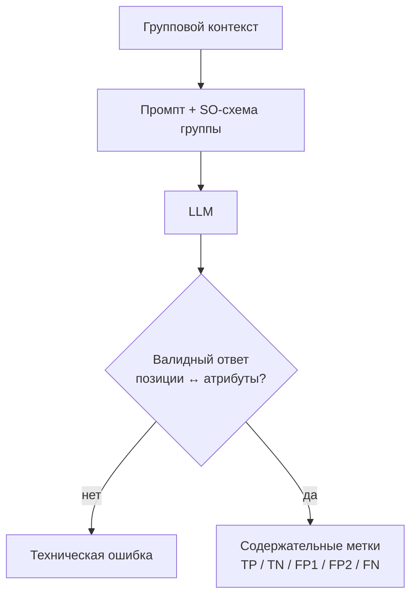

# H001 - Typing and structured output stability

## 1. Approach

Два связанных изменения слоя извлечения (на входе — уже сгруппированный контекст после поиска и реранка):

1. **Типизация правил** — вместо общих инструкций раздельные правила для number (+ единица), string, categorical, boolean и явного пустого результата. Цель: снизить FP2 (неверное значение) и FP1 (заполнение при пустом эталоне) за счёт типовых ограничений.
2. **Стабильность structured output** — фиксированная длина/порядок результата группы (позиция i ↔ i-й атрибут), schema-валидация на стороне интерфейса модели, явное отделение технических ошибок разбора от содержательных FN/FP2.

Метки: TP / TN / FP1 / FP2 / FN; отдельно счётчик технических ошибок.

## 2. Expected effect / hypothesis

**H-type.** Размытая постановка порождает разные классы ошибок по типам данных. Типозависимые правила поднимут accuracy и уберут часть FP1/FP2 без смены retrieval.

**H-SO.** «JSON в промпте» недостаточен: невалидный JSON, валидный JSON неверной формы и сдвиг позиций в группе маскируют содержательные ошибки. Стабилизация схемы обнулит tech errors и сделает сравнимыми последующие эксперименты.

## 3. Runs and metrics

Исторические результаты серии (без MLflow run ID в этом репозитории).

**Типизация (ранняя проверка):**

| Вариант | accuracy | Технические ошибки |
| --- | ---: | ---: |
| Общие инструкции | 0.4444 | 6 |
| Типозависимые правила | 0.5309 | 0 |

**Стабильность формата ответа:**

| Вариант | n случаев | accuracy | Технические ошибки |
| --- | ---: | ---: | ---: |
| Structured output без достаточной стабилизации группового результата | 1580 | 0.7152 | 264 |
| Стабилизированная схема + модельная конфигурация | 1580 | 0.7361 | 0 |
| Регресс: возврат к SO без восстановления некорректного формата (ранняя проверка, один документ) | 162 | 0.6296 | 50 |

## 4. Interpretation

Типизация дала ранний скачок accuracy (**0.44 → 0.53**) и сняла tech errors на малой проверке: это не «косметика промпта», а необходимый каркас схемы извлечения.

Стабилизация формата на большом объёме (n=1580) подняла accuracy **0.715 → 0.736** и обнулила 264 технические ошибки. Без этого сравнение содержательных гипотез невозможно: сбои разбора смешиваются с FN/FP2. Контрольный регресс (50 tech errors на 162 случаях) подтверждает, что «включить structured output» само по себе не гарантия — нужна связка порядок + schema + обработка сбоев.

## 5. Error analysis

Связь типов с целевыми ошибками (до/после типизации):

| Тип | Типичный сбой | Метка | Ограничение |
| --- | --- | --- | --- |
| Number + единица | соседняя строка / лишний квалификатор | FP2, реже FP1 | связь с меткой в том же блоке; единица отдельно |
| String | пересказ / полное имя вместо родового типа | FP2 | брать строку из источника |
| Categorical | близкий, но недопустимый вариант | FP2, FN | только допустимый список (+ отдельно крупные справочники) |
| Boolean | требование → «факт» | FP1 | true только при явном подтверждении |
| Пустое | заполнение соседним значением | FP1 | нет связи → пустой результат |

Tech errors до стабилизации: невалидный JSON, неверная форма, сдвиг позиций в группе. После — содержательные метки читаются напрямую.

## 6. Conclusion

Типизация и стабильный structured output — фундамент слоя extraction: растёт accuracy, tech errors перестают маскировать смысл. Дальнейшие эксперименты шага можно сравнивать по TP/FP1/FP2/TN/FN.

## 7. Decision

**Adopt** типозависимые правила и стабилизированную групповую SO-схему. Следующий эксперимент в этом шаге — групповое извлечение близких атрибутов, настройка confidence и итог пилота (H002).
