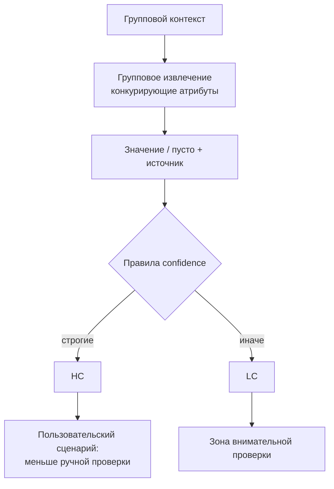

# H002 - Group extract, confidence, and pilot metrics

## 1. Approach

Финальный блок слоя extraction и закрытие пилота (после H001):

1. **Групповое извлечение** — близкие атрибуты извлекаются совместно из общего контекста; рассуждение: кандидаты → сопоставление с именами → запрет двойного присвоения → безопасный пустой ответ при слабой связи.
2. **Настройка уверенности (HC/LC)** — не «мнение модели», а правила: для пустых — сила лучшего контекстного кандидата; для извлечённых — достаточный score источника, нет сильной альтернативы, имя/эквивалент атрибута в выбранном блоке.
3. **Итоговая конфигурация** и **бизнес-метрики пилота** на трёх классах оборудования.

Сопутствующие предметные правки (дополнения к ТЗ / исполнение, сборка таблиц, крупные categorical-справочники, extraction hints) входили в доводку той же линии; здесь фиксируются ключевые цифры группового извлечения, confidence trade-off и итог пилота.

## 2. Expected effect / hypothesis

**H-group.** Изолированное извлечение путает соседние характеристики (FP2/FP1). Совместная обработка снизит смешение близких атрибутов.

**H-conf.** Более строгая HC-метка снизит overall accuracy и долю HC, но повысит надёжность HC-подмножества — нужный компромисс для сценария «автоприём vs ручная проверка».

**H-pilot.** Связка решений слоёв retrieval → rerank → extraction выведет Automation Rate / Net Effect / NPV / NPV@HC к целевым порогам пилота или выше.

## 3. Runs and metrics

Исторические результаты серии (без MLflow run ID в этом репозитории).

**Групповое извлечение:**

| Проверка | Метрика | До | После |
| --- | --- | ---: | ---: |
| Ранняя | accuracy | 0.5556 | 0.6049 |
| Ранняя | accuracy LC | 0.6707 | 0.7500 |
| Основной набор | accuracy | 0.7361 | 0.7462 |

**Confidence (класс «Баки», сбалансированные варианты):**

| Вариант | overall accuracy | accuracy HC | accuracy LC | # HC | # LC | Tech errors |
| --- | ---: | ---: | ---: | ---: | ---: | ---: |
| Лучший по overall | 0.7835 | 0.7895 | 0.7716 | 1101 | 479 | 2 |
| Более строгая HC | 0.7766 | 0.8878 | 0.7075 | 600 | 980 | 1 |

**Итоговые метрики пилота (три класса):**

| Метрика | Баки | Теплообменники | Фильтры сетчатые | Средневзвешенное | Цель |
| --- | ---: | ---: | ---: | ---: | ---: |
| Automation Rate | 78,47% | 69,79% | 72,75% | **74,30%** | ≥ 55% |
| Net Effect | 0,41 | 0,28 | 0,43 | **0,37** | ≥ 0,2 |
| NPV | 85,36% | 82,55% | 82,55% | **83,85%** | ≥ 60% |
| NPV @ high confidence | 90,86% | 87,87% | 91,67% | **90,04%** | ≥ 90% |

## 4. Interpretation

Групповое извлечение даёт устойчивый, но умеренный прирост на основном наборе (**0.736 → 0.747**) при более заметном эффекте на ранней проверке. Смысл — конкуренция близких значений внутри группы, а не экономия вызовов LLM.

Строгая confidence — **не** улучшение overall: overall чуть падает, HC становится заметно надёжнее (**0.89**), доля HC сокращается. Для продукта это управляемый рычаг «сколько результатов можно принимать с меньшей ручной нагрузкой».

Пилотные бизнес-метрики: Automation Rate, Net Effect и NPV **существенно выше** целевых порогов; NPV@HC в среднем **на цели** (~90%). По классам картина неоднородна (теплообменники слабее по Automation Rate), но ни один класс не проваливает пороги Automation / Net Effect / NPV.

## 5. Error analysis

**Групповое извлечение — остаток.** В срезе mismatch при непустом эталоне значимая доля уходит в `pred=null`; среди содержательных ошибок выделялись конкуренция внутри групп (организации, габариты, толщины, комплектность). Группировка снижает часть FP2, но не заменяет локальные правила дизамбигуации.

**Confidence.** Ужесточение правил отсекает пограничные извлечения из HC — overall и LC accuracy отражают более «трудный» хвост.

**Смежные находки доводки (кратко):**

- приоритет дополнений к ТЗ и привязка к коду исполнения снимают FP2 при «сильном, но не том» источнике;
- неполная сборка таблицы даёт FN/FP2 на размерных атрибутах;
- крупные categorical-справочники требуют укороченного candidate list; для организаций узкое место часто полнота справочника, а не только retrieval кандидатов;
- extraction hints сильно помогают на целевых атрибутах при отборе по проверке и могут вредить, если навязывают неверное правило.

## 6. Conclusion

Качество пилота сложилось связкой слоёв, а не одной моделью: типизация и SO (H001), групповое извлечение, правила источника/таблиц/справочников/подсказок и отдельная калибровка confidence. На «Баках» сбалансированный вариант — accuracy **0.7835** при 2 tech errors; строгий HC — **0.8878** при overall **0.7766**. Средневзвешенные метрики пилота достигают целей.

## 7. Decision

**Adopt** групповое извлечение близких атрибутов и настраиваемую confidence как часть базового решения. Конфигурацию пилота считать **принятой** относительно заявленных целевых метрик. Следующий исследовательский фокус вне этого исторического контура — качество документного слоя на сканах (OCR / VLM).
