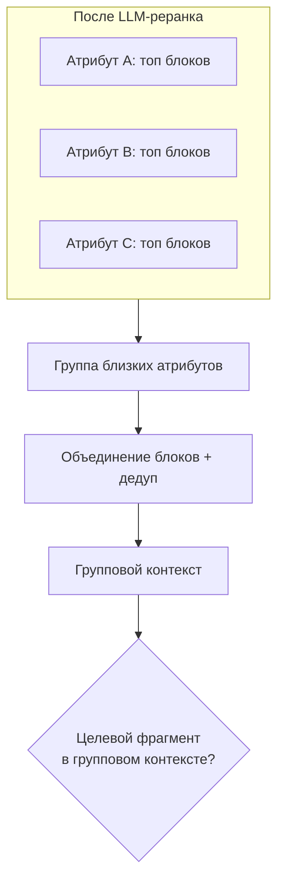

# H002 - Context grouping for related attributes

## 1. Approach

После LLM-реранка (H001) у каждого атрибута свой топ блоков. Для близких характеристик (давления, температуры, габариты, патрубки, роли организаций и т.п.) проверялась **группировка контекста**: объединение уже отобранных блоков связанных атрибутов, дедупликация, сохранение порядка по релевантности.

Отдельно — **ужесточение инструкций** LLM-реранкера: явная связка атрибут↔значение, штраф за соседние строки и похожие параметры, учёт единиц и варианта исполнения, подсказка как правило области. Это не новое ранжирование с нуля, а уточнение логики оценки блока.

Главная метрика группировки — **coverage группового контекста** vs coverage после реранка (окно).

## 2. Expected effect / hypothesis

**H-group.** Целевой блок часто полезен сразу нескольким близким атрибутам. Объединение контекстов повысит вероятность, что источник значения доступен группе, даже если для одного атрибута он был на границе окна.

**H-rubric.** Жёсткая рубрика снизит «ложно высокие» оценки тематически похожих, но непригодных блоков. Большого скачка coverage на общем наборе может не быть — важен контроль качества кандидатов и корректность при нескольких исполнениях.

## 3. Runs and metrics

Исторические результаты серии (без MLflow run ID в этом репозитории).

**Группировка:**

| Проверка | coverage после реранка | coverage группового контекста |
| --- | ---: | ---: |
| Ранняя пакетная | 0.902 | 0.938 |
| Основной набор, исходная настройка | 0.91 | 0.95 |
| Основной набор после уточнения контекста и группировки | 0.97 | 0.99 |

**Уточнение инструкций реранкера:**

| Вариант | coverage после реранка | Recall@1 | coverage группового |
| --- | ---: | ---: | ---: |
| До ужесточения | 0.97 | 0.82 | 0.98 |
| Жёсткая рубрика | 0.98 | 0.81 | 0.98 |
| + учёт варианта исполнения | 0.97 | 0.81 | 0.98 |

## 4. Interpretation

Группировка стабильно **добавляет покрытие** поверх окна реранка (примерно +3–4 п.п. на ранних проверках; на доведённом основном наборе групповой контекст доходит до **0.99**). Механизм — не повторный поиск, а шаринг блоков между связанными атрибутами.

Ужесточение инструкций почти не двигает агрегатные цифры, но меняет критерий «хорошего» блока: высокая оценка только при надёжной связке с значением. Правило варианта исполнения нужно для корректности на документах с несколькими исполнениями, даже когда средний coverage flat.

## 5. Error analysis

Группировка помогает, когда близкие атрибуты опираются на **один табличный/разделный фрагмент**. Она не лечит:

- отсутствие значения в корпусе;
- путаницу ролей/строк при извлечении значения (слой `extraction`);
- завышенный score «похожего» блока — здесь как раз рубрика реранкера.

Небольшой спад диагностического Recall@1 при жёсткой рубрике при росте/сохранении coverage — допустимый обмен: реранкер становится консервативнее к «почти релевантному» шуму.

## 6. Conclusion

Групповой контекст — отдельный обязательный слой перед извлечением: повышает доступность источника для связанных характеристик. Уточнение инструкций LLM-реранкера — качественное, не «метрик-хак»: фиксирует предметные правила оценки блока.

## 7. Decision

**Adopt** grouping контекста близких атрибутов. **Adopt** ужесточённую рубрику LLM-реранкера (включая вариант исполнения). Серия `reranking` на этом закрыта; дальше — слой `extraction`.
