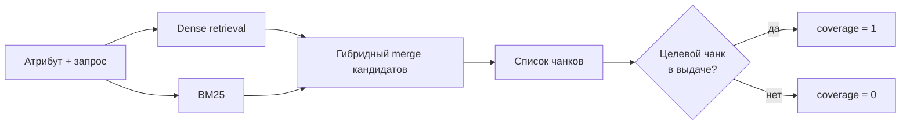

# H001 - Hybrid retrieval baseline

## 1. Approach

Baseline слоя поиска: для каждого атрибута формируется запрос, затем выполняется **гибридный поиск** (семантика + лексическое совпадение) по чанкам документа. Оценивается, попадает ли размеченный целевой чанк (источник значения) в найденный контекст **до** переранжирования и извлечения.

### Scope

| Параметр | Значение |
| --- | --- |
| Класс | Баки |
| Документы | основной набор, 10 документов |
| Единица оценки | пара «документ – атрибут» с размеченным целевым чанком |
| Поверхность | исходный список найденных чанков |

### Метрики слоя

- **coverage** — целевой чанк есть хотя бы где-то в проверяемом контексте
- **Recall@K** — целевой чанк в первых K кандидатах
- **средний ранг** — позиция первого попадания среди случаев с coverage = 1

## 2. Expected effect / hypothesis

**H.** Сочетания dense + BM25 достаточно, чтобы для большей части размеченных пар источник значения оказался в выдаче. Полного покрытия компактным окном (K ≤ 10) не ожидается: часть целевых фрагментов будет ниже топа.

**Критерий полезности.** Если coverage заметно ниже ~0.9 на основном наборе — слой поиска нельзя считать рабочей базой, и доработки extraction бессмысленны без фикса retrieval.

## 3. Runs and metrics

Исторические результаты серии (без привязки к MLflow run ID в этом репозитории).

| Поверхность | coverage | Recall@5 | Recall@10 | Средний ранг |
| --- | ---: | ---: | ---: | ---: |
| Исходные найденные чанки | 0.91 | 0.75 | 0.83 | 3.44 |

## 4. Interpretation

Первичный гибридный поиск уже находит источник значения для большей части размеченных пар (coverage 0.91). Разрыв между coverage и Recall@10 показывает, что часть целевых фрагментов лежит **за пределами** компактного окна из 10 кандидатов: база рабочая, но сама по себе не гарантирует, что нужный чанк попадёт в узкий контекст для LLM.

Средний ранг 3.44 при coverage 0.91 согласуется с картиной «часто находим, но не всегда поднимаем в самый верх».

## 5. Error analysis

Типичные промахи на этом этапе (по разбору размеченных пар):

- значение живёт в **таблице**, а запрос по названию атрибута лучше матчится на структурный текст без ячейки;
- короткий табличный/текстовый фрагмент **без заголовка раздела** слабо семантически связан с запросом;
- часть атрибутов плохо находится по официальному имени и синонимам из справочника (коды документов, НД классификации, патрубки и т.п.) — слабый запрос, а не дефект гибридного скоринга как такового.

## 6. Conclusion

Гибридный поиск — **достаточная отправная точка** слоя retrieval: coverage высокий, но окно K=5…10 не закрывает все случаи. Дальнейший рост качества контекста нужно искать в представлении фрагментов и запросе, а не в замене hybrid на другой retriever.

## 7. Decision

**Adopt** hybrid retrieval как baseline слоя поиска. Следующий эксперимент в этом шаге — обогащение представления фрагментов и объединение текста с таблицами (H002).
