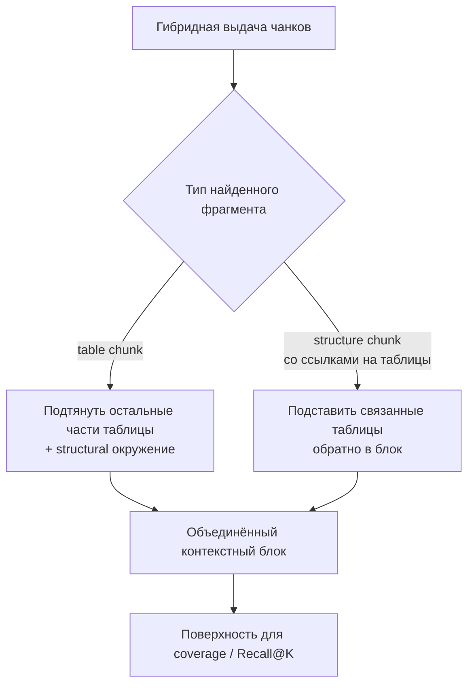

# H002 - Headers and table/text context merge

## 1. Approach

Два связанных изменения представления контекста поверх гибридного поиска (H001):

1. **Структурные заголовки** — к индексируемым фрагментам добавляется путь/название раздела, чтобы короткий табличный или текстовый чанк был информативнее для поиска.
2. **Объединение текста и таблиц** — после первичного поиска восстанавливается связанный структурный контекст: найденная табличная часть дополняется остальными частями таблицы и структурным окружением; найденный structural-фрагмент со ссылками на таблицы получает таблицы обратно в блок.

Оцениваются coverage / Recall@K на поверхностях «исходные чанки» vs «объединённые контекстные блоки» и отдельно эффект заголовков на окне из 10 кандидатов.

## 2. Expected effect / hypothesis

**H1 (заголовки).** Заголовок раздела повысит семантическую близость запроса по атрибуту и фрагмента → вырастет покрытие окна.

**H2 (merge).** В ТУ/ТЗ значение часто распределено между ячейкой таблицы и структурным смыслом (заголовок, соседние части таблицы). Объединение связанных фрагментов повысит coverage относительно списка сырых чанков.

**Критерий.** Заголовки принимаем, если не вредят и дают прирост или стабилизируют представление. Merge — если coverage растёт на основном наборе «Баки».

## 3. Runs and metrics

Исторические результаты серии (без MLflow run ID в этом репозитории).

**Заголовки (окно из 10 кандидатов):**

| Вариант | Покрытие окна@10 | Recall@5 |
| --- | ---: | ---: |
| База сравнения серии | 0.923 | 0.847 |
| + структурные заголовки | 0.923 | 0.849 |

**Объединение текста и таблиц (основной набор «Баки», тот же базовый поиск):**

| Поверхность | coverage | Recall@5 | Recall@10 |
| --- | ---: | ---: | ---: |
| Исходные найденные чанки | 0.91 | 0.75 | 0.83 |
| Объединённые контекстные блоки | 0.94 | 0.80 | 0.89 |

## 4. Interpretation

Заголовки **не ухудшили** поиск, но и **не дали** самостоятельного прироста покрытия. Их ценность — в структурном представлении контекста для последующих этапов, а не в скачке coverage.

Merge дал измеримый рост: coverage **0.91 → 0.94**, Recall@5/10 тоже выросли. Это подтверждает, что для технической документации недостаточно ранжировать изолированные чанки: источник значения часто «размазан» между таблицей и структурным окружением.

## 5. Error analysis

Остаточные промахи после merge:

- атрибуты, где целевой фрагмент всё ещё не попадает в окно из‑за слабого запроса (имя/синонимы не совпадают с формулировкой в ТУ);
- случаи, когда нужная ячейка уже в контексте, но на этапе извлечения путается соседняя строка/колонка — это ошибка слоя extraction, не coverage поиска.

Заголовки не чинили системные дыры покрытия: проблема была не в отсутствии одного слова-раздела в чанке, а в связности table↔structure.

## 6. Conclusion

Обогащение заголовками — нейтральное структурное улучшение без прироста coverage. **Объединение текстового и табличного контекста** — обязательный слой после первичного поиска: coverage и компактность окна улучшаются согласованно.

## 7. Decision

**Adopt** table/text merge в базовый алгоритм. **Keep** заголовки как часть структурного представления, не как драйвер метрик. Следующий эксперимент в этом шаге — предметные поисковые подсказки (H003).
