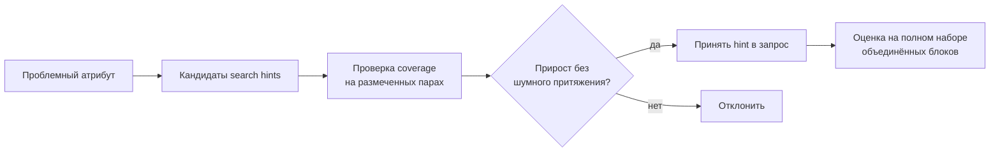

# H003 - Domain search hints

## 1. Approach

Для атрибутов со систематическими промахами поиска (после H001–H002) проверялись короткие **предметные поисковые подсказки**: устойчивые фразы окружения значения в ТУ/ТЗ (не произвольное «описание атрибута»).

Отбор: несколько вариантов на проблемный атрибут → берём тот, что повышает coverage и не привязан к единичной формулировке одного документа. Подсказка, которая тянет нерелевантные нормативные куски или не поднимает coverage, отклоняется.

Оценка на объединённых контекстных блоках: coverage, Recall@K, средний ранг; плюс точечные срезы по атрибутам.

## 2. Expected effect / hypothesis

**H.** Часть атрибутов плохо находится по официальному имени и синонимам справочника. Точечные search hints, отобранные по coverage, дадут основной прирост покрытия на слое поиска — сильнее, чем заголовки в H002.

**Риск.** Слишком широкая подсказка ухудшит precision выдачи (шумный контекст для последующего реранка и извлечения).

## 3. Runs and metrics

Исторические результаты серии (без MLflow run ID в этом репозитории).

**Примеры точечного эффекта (coverage по атрибуту):**

| Атрибут (тип) | Без подсказки | С выбранной подсказкой |
| --- | ---: | ---: |
| Код документа с заданием на разработку / образец | 0.20 | 1.00 |
| Код технической документации | 0.33 | 0.78 |
| НД для категории сейсмостойкости | 0.56 | 1.00 |
| НД для класса безопасности | 0.78 | 1.00 |
| Диаметр номинальный входного патрубка | 0.50 | 1.00 |

**Итог на основном наборе (объединённые блоки):**

| Вариант | coverage | Recall@5 | Recall@10 | Средний ранг |
| --- | ---: | ---: | ---: | ---: |
| Без новых поисковых подсказок | 0.94 | 0.80 | 0.89 | 2.87 |
| Первая итерация подсказок | 0.97 | 0.87 | 0.94 | 2.46 |
| Вторая итерация подсказок | 0.98 | 0.89 | 0.95 | 2.33 |

## 4. Interpretation

Search hints дали **главный прирост coverage** на слое retrieval: 0.94 → 0.98 при одновременном улучшении Recall@K и ранга. Эффект локализован на проблемных атрибутах, но на полном наборе виден как устойчивый сдвиг, а не единичный outlier.

Интерпретировать нужно через coverage: подсказки повышают вероятность, что источник значения **вообще доступен** на следующих этапах пайплайна. Они не заменяют реранкер и не гарантируют правильное извлечение.

## 5. Error analysis

Подсказки работают, когда фиксируют **устойчивые маркеры** документа (реквизиты, титул, табличные обозначения патрубков, связка «характеристика ↔ нормативная база»).

Отказы при отборе:

- подсказка не поднимала coverage;
- подсказка притягивала нерелевантные нормативные фрагменты.

Оставшиеся ~2% без coverage — не закрываются общим промптом retrieval; это либо редкие формулировки, либо отсутствие значения в корпусе/разметке.

## 6. Conclusion

Предметные поисковые подсказки — наиболее результативный рычаг покрытия на слое поиска **при условии отбора по проверке**, а не массового добавления текстов «для ясности». Вместе с hybrid (H001) и table/text merge (H002) слой retrieval доводит coverage объединённых блоков до ~0.98 на основном наборе «Баки».

## 7. Decision

**Adopt** отобранные search hints в справочник атрибутов / запрос поиска. Серия retrieval на этом закрыта; дальше — уточнение порядка и состава контекста на шаге `reranking`.
